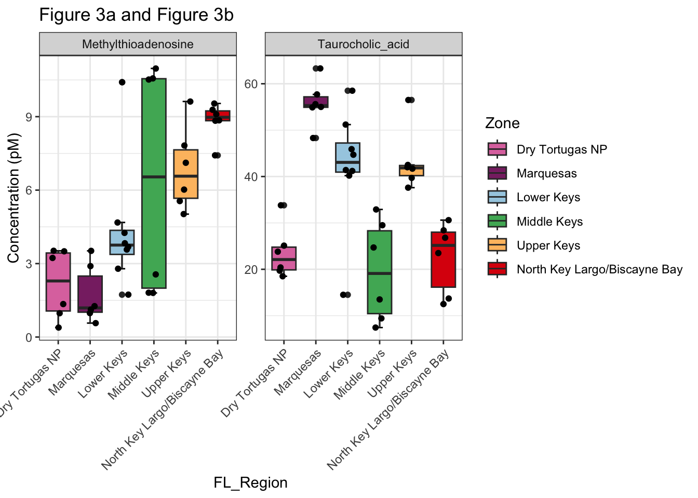
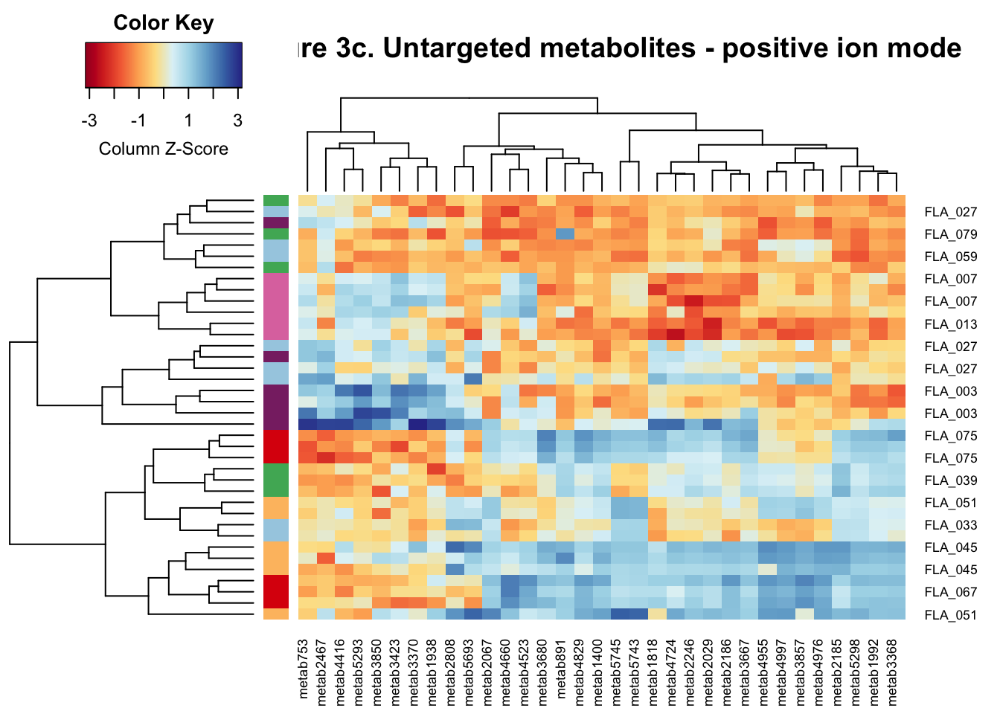
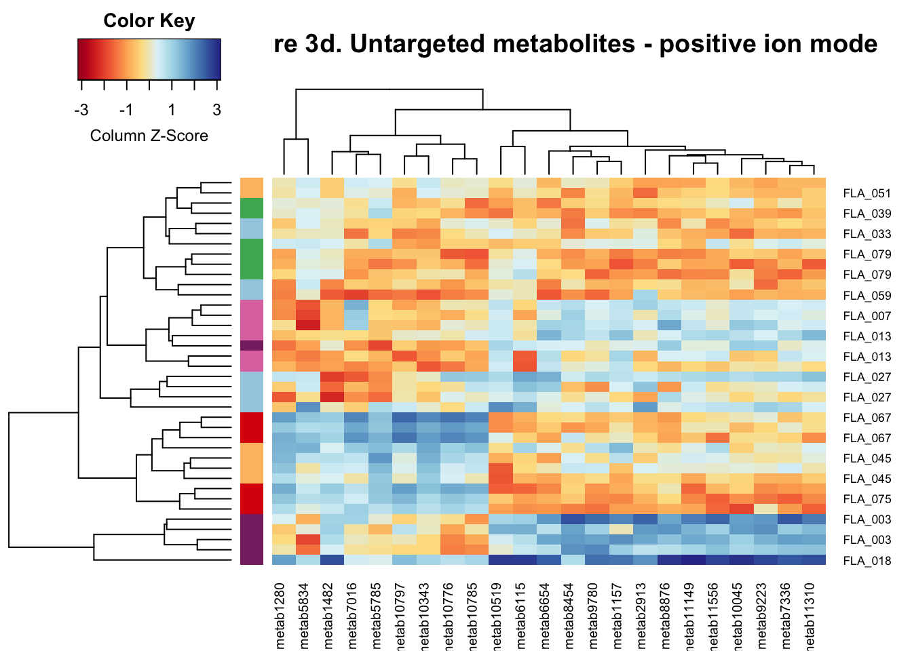

# Setup

### Install necessary packages


```r
# For data wrangling and stats tests
library(tidyverse); packageVersion("tidyverse")
library(rstatix); packageVersion("rstatix")
library(plyr); packageVersion("plyr")
library(dplyr); packageVersion("dplyr")

# For visualization
library(ggplot2); packageVersion("ggplot2")
theme_set(theme_bw())
library(gplots); packageVersion("gplots")
library(RColorBrewer); packageVersion("RColorBrewer")
```

### Read in prepped data

Targeted metabolome data Import the data that has been corrected for extraction efficiency and converted to picomolar


```r
metadata_Target_Mtb = read.table('data/Targeted_metadata.txt', header=T, sep='\t')
conc_Target_Mtb = read.table('data/Targeted_corrected_env_conc_pM.txt', header=T, sep='\t')

#order the metadata and targeted data so it is the same
idx <- match(metadata_Target_Mtb$Observations, conc_Target_Mtb$X)
conc_Target_Mtb <- conc_Target_Mtb[idx,]
```

Untargeted metabolome data - positive and negative ion modes Import the data that has been filered and normalized


```r
metab_untarg_neg <- read.table("data/Untargeted_filtered_Normalized_negative_mode.txt", 
                               sep = "\t", header = TRUE, row.names = 1)
metab_untarg_pos <- read.table("data/Untargeted_filtered_Normalized_positive_mode.txt", 
                               sep = "\t", header = TRUE, row.names = 1)
metadata_untarg_mtb <- read.table("data/Untargeted_metadata.txt", 
                                  sep = "\t", header = TRUE, row.names = 1)

#reorder metadata
metadata_untarg_mtb <- metadata_untarg_mtb[match(row.names(metab_untarg_neg), row.names(metadata_untarg_mtb)),]

#Remove columns with an NA because that messes with the analysis
metab_untarg_neg <- metab_untarg_neg[ , colSums(is.na(metab_untarg_neg)) == 0]
metab_untarg_pos <- metab_untarg_pos[ , colSums(is.na(metab_untarg_pos)) == 0]
```

# Figure 3

**Zones in Florida's Coral Reef (FCR) harbor significantly different concentrations of dissolved metabolites**

**Figure 3.** a) 5'-methylthioadenosine (MTA) and (b) taurocholic acid. Concentrations were significantly different between FCR zones (Kruskal-Wallis test, Bonferroni-corrected p \< 0.00128). Heatmaps of z-score standardized feature peak intensities depict untargeted metabolites that ionized in (c) negative or (d) positive ion modes that were significantly different across zones (ANOVA or Kruskal-Wallis test, significant at Bonferroni-corrected p, See SI Methods). Colors to the left of the heatmap indicate reef zone. Adjacent zones 5 & 6 in the Lower Keys and zones 2 & 3 in the Upper Keys were combined to ensure at least 2 reefs were within each group for statistical tests.

## Figure 3a & 3b - Targeted metabolites

Conduct statistical tests and visualize the results. Loop tyhrough each mnetabolite. Do a kruskal-wallis test on each of the variables. Save the p-value. Also generate a bonferroni-corrected p-value because you are doing multiple comparisons and the likelihood of getting a significant results due to chance is high. If the bonferroni-corrected p-value is less than 0.05, conduct a post-hoc test. Use a pairwise wilcoxon test to get p-values between each combination of zones. Save resultss.


```r
MetabMeta_targ <- merge(metadata_Target_Mtb, conc_Target_Mtb, by.x = "Observations", by.y = "X") #merge the data with metadata. by.x and by.y note the different columns to use. 

variables <- colnames(MetabMeta_targ[,55:93])
kruskal.result <- data.frame()
wilcox.result <- list()
Bonf.alpha <- 0.05/length(variables)
for (i in 55:93) {
  result <- kruskal.test(MetabMeta_targ[,i] ~ MetabMeta_targ[,"FL_Region"]) #do kruskal wallis test on each variable of interest
  kruskal.result <- rbind(kruskal.result, result) #save kruskal wallis test results
  wilcox <- pairwise.wilcox.test(MetabMeta_targ[ ,i], MetabMeta_targ[ ,"FL_Region"], p.adjust.method = "BH") #use pairwise test to see which zones were signficant against other zones
  wilcox.result[[i]] <- wilcox$p.value #save pairwise results to a list
}

colnames(kruskal.result) <- c("chi-sq statistic", "df", "pvalue", "test", "variables") 
kruskal.result2 <- kruskal.result %>%
  mutate(significant = ifelse(pvalue < Bonf.alpha, "Yes", "no")) #evaluate sig with Bonferroni-corrected p

rownames(kruskal.result2) <- variables #add new rownames that are the metabolite names
names(wilcox.result) <- colnames(MetabMeta_targ)

# Save wilcox rank sum results to an excel document
# write.xlsx(wilcox.result, file = "Supp_WilcoxResults_metabs.xlsx", row.names = TRUE)

# Display p values
kruskal.result2 %>% 
  filter(significant == "Yes") %>%
  dplyr::select(pvalue)
```

```
##                                         pvalue
## x5__deoxy_5__methylthio_adenosine 9.535191e-04
## sodiumTaurocholate                7.198988e-05
```

```r
#select columns of significant variables across zones
MetabMetaSig_targ <- MetabMeta_targ %>%
  dplyr::select(Observations, Site, zonenumber, collab_siteID, 
                FL_Region, FL_region_zone, x5__deoxy_5__methylthio_adenosine, sodiumTaurocholate) %>%
  mutate(FL_Region = factor(FL_Region, 
                            levels = c("Dry Tortugas NP", "Marquesas", "Lower Keys", "Middle Keys", 
                                       "Upper Keys", "North Key Largo/Biscayne Bay"))) %>% 
  dplyr::rename("Methylthioadenosine" = x5__deoxy_5__methylthio_adenosine,
                "Taurocholic_acid" = sodiumTaurocholate) %>%
  gather(key = "metabolite", value = "Concentration", Methylthioadenosine:Taurocholic_acid)

ggplot(MetabMetaSig_targ, aes(x = FL_Region, y = Concentration, na.rm = TRUE)) + 
  stat_boxplot(geom = "errorbar", width = 0.2) + 
  geom_boxplot(data = MetabMetaSig_targ, aes(fill = FL_Region)) + 
  geom_point(position = position_jitter(0.2)) +
  labs(title = "Figure 3a and Figure 3b", y = "Concentration (pM)", fill = "Zone") + 
  scale_fill_manual(values = c("#DE77AE", "#882E72", "#A6CEE3","#4EB265","#FDBF6F","#DC050C")) +
  facet_wrap(. ~ metabolite, scales = "free_y") +
  theme(axis.text.x=element_text(angle = 45, hjust = 1))
```



## Figure 3c


```r
Neg_MetabMeta <- cbind(metadata_untarg_mtb, metab_untarg_neg) #merge the data with metadata. 

#order the variables by site
Neg_MetabMeta$Site <- factor(Neg_MetabMeta$Site,
                             levels=c("FLA_007", "FLA_013", "FLA_003", "FLA_018", "FLA_027", "FLA_059", 
                                      "FLA_033", "FLA_039", "FLA_079", "FLA_045", "FLA_051", "FLA_067", "FLA_075"))

Neg_colnames <- colnames(Neg_MetabMeta[,55:1196]) #make a vector of column names
Neg_normalityresults = tibble(metabolite = "names", DTNP =0, LK = 0, Marq = 0, MK = 0, NKLBB = 0, UK = 0) #initialize a tibble
for (name in Neg_colnames) {     
  x = Neg_MetabMeta %>%    
    group_by(FL_Region) %>% 
    shapiro_test(name)       
  result = tibble(metabolite = name, DTNP = x$p[1], LK = x$p[2], Marq = x$p[3], MK = x$p[4], NKLBB = x$p[5], UK = x$p[6])  
  Neg_normalityresults = bind_rows(Neg_normalityresults, result) 
}

#Add a column called BothNormal to results stating pass normality assumption (normal if p>0.05)  
Neg_normalityresults2 <- Neg_normalityresults[2:1143,] %>% #get rid of first row
  mutate(BothNormal = if_else(DTNP > 0.05 & LK > 0.05 & Marq > 0.05 & MK > 0.05 & NKLBB > 0.05 & UK > 0.05, "Yes", "No")) 

# How many metabolites are normally distributed?
plyr::count(Neg_normalityresults2$BothNormal) # 451 are NOT, 691 ARE normal 
```

```
##     x freq
## 1  No  451
## 2 Yes  691
```

```r
### NORMAL THEN ANOVA ###
Neg_normal <- Neg_normalityresults2[Neg_normalityresults2$BothNormal == "Yes",]
Neg_normalmetabs <- Neg_normal$metabolite

Neg_metabsAOV <- Neg_MetabMeta %>%
  select(Date, Site, FL_Region, SCTLDprevalence, all_of(Neg_normalmetabs)) #select normally distributed metabs

Neg_variables <- colnames(Neg_metabsAOV[,5:695])
Neg_anova.result <- data.frame()
Neg_Tukey.result <- list()
Neg_Bonf.alpha <- 0.05/length(Neg_variables)
for (i in 5:695) {
  result <- aov(Neg_metabsAOV[,i] ~ Neg_metabsAOV[,"FL_Region"]) #do anova on each metabolite of interest
  aov.summary <- summary(result)
  Neg_anova.result <- rbind(Neg_anova.result, aov.summary[[1]][1,1:5]) #save anova results
  tukey <- TukeyHSD(result) #conduct post-hoc test
  Neg_Tukey.result[[i]] <- tukey$`Neg_metabsAOV[, "FL_Region"]` #save pairwise results
}
colnames(Neg_anova.result) <- c("df", "sumsquares", "MeanSq", "Fvalue", "pvalue") #add column names
Neg_anova.result2 <- Neg_anova.result %>%
  mutate(significant = ifelse(pvalue < Neg_Bonf.alpha, "Yes", "no")) #evaluate if signficant at Bonferroni-corrected p
rownames(Neg_anova.result2) <- Neg_variables #add new rownames

names(Neg_Tukey.result) <- colnames(Neg_metabsAOV)

#how many significant results?
plyr::count(Neg_anova.result2$significant) #ONLY 32!!!
```

```
##     x freq
## 1  no  659
## 2 Yes   32
```

```r
#Save the significant metabolites
Neg_sigmetabsAOV <- Neg_anova.result2[Neg_anova.result2$significant == "Yes",]

Neg_SigAOV <- Neg_MetabMeta %>%
  select(Date, Site, zonenumber, collab_siteID, FL_Region,  
         all_of(rownames(Neg_sigmetabsAOV))) %>%
  mutate(FL_Region = factor(FL_Region, 
                            levels = c("Dry Tortugas NP", "Marquesas", "Lower Keys", 
                                       "Middle Keys", "Upper Keys", "North Key Largo/Biscayne Bay")))

### NOT NORMAL THEN KRUSKAL WALLIS TEST ###

Neg_notnormal <- Neg_normalityresults2[Neg_normalityresults2$BothNormal == "No",]
Neg_notnormalmetabs <- Neg_notnormal$metabolite

Neg_metabsKW <- Neg_MetabMeta %>%
  select(Date, Site, FL_Region, SCTLDprevalence, all_of(Neg_notnormalmetabs)) #select not normal metabs

Neg_nonnormal_variables <- colnames(Neg_metabsKW[,5:455]) 
Neg_kruskal.result <- data.frame()
Neg_wilcox.result <- list()
Neg_Bonf.alpha <- 0.05/length(Neg_nonnormal_variables)
for (i in 5:455) { 
  result <- kruskal.test(Neg_metabsKW[,i] ~ Neg_metabsKW[,"FL_Region"]) 
  Neg_kruskal.result <- rbind(Neg_kruskal.result, result) 
  wilcox <- pairwise.wilcox.test(Neg_metabsKW[,i], Neg_metabsKW[ ,"FL_Region"], p.adjust.method = "BH") 
  Neg_wilcox.result[[i]] <- wilcox$p.value #save pairwise results to a list
}

colnames(Neg_kruskal.result) <- c("chi-sq statistic", "df", "pvalue", "test", "variables") #add column names
Neg_kruskal.result2 <- Neg_kruskal.result %>%
  mutate(significant = ifelse(pvalue < Neg_Bonf.alpha, "Yes", "no")) #evaluate if sig at Bonferroni-corrected p
rownames(Neg_kruskal.result2) <- Neg_nonnormal_variables #add new rownames

names(Neg_wilcox.result) <- colnames(Neg_metabsKW)

#how many significant results?
plyr::count(Neg_kruskal.result2$significant) #Only 1!!
```

```
##     x freq
## 1  no  450
## 2 Yes    1
```

```r
#extract significant metab names
Neg_sigmetabsKW <- Neg_kruskal.result2[Neg_kruskal.result2$significant == "Yes",] #1

Neg_SigKW <- Neg_MetabMeta %>%
  select(Date, Site, zonenumber, collab_siteID, FL_Region, all_of(rownames(Neg_sigmetabsKW))) %>%
  mutate(FL_Region = factor(FL_Region, 
                            levels = c("Dry Tortugas NP", "Marquesas", "Lower Keys", 
                                       "Middle Keys", "Upper Keys", "North Key Largo/Biscayne Bay")))


# Extract the significant metabolites in prep for plotting
Neg_sig_metabs <- cbind(Neg_SigAOV, "metab2186" = Neg_SigKW$metab2186)
Neg_sig_metabs2 <- as.matrix(Neg_sig_metabs[,6:38])
rownames(Neg_sig_metabs2) <- Neg_sig_metabs$Site


# Example: grouping from the first letter:
my_group <- as.numeric(as.factor(Neg_sig_metabs$FL_Region))
rainbowpal = c("#DE77AE", "#882E72", "#A6CEE3","#4EB265","#FDBF6F","#DC050C")
colSide <- rainbowpal[my_group]

col <- colorRampPalette(brewer.pal(10, "RdYlBu"))(256)

heatmap.2(Neg_sig_metabs2,
        density.info = "none",
        trace = "none",
        col = col,
        scale="column", 
        RowSideColors=colSide, 
        main = "Figure 3c. Untargeted metabolites - positive ion mode")
```




## Figure 3d


```r
Pos_MetabMeta <- cbind(metadata_untarg_mtb, metab_untarg_pos) #merge the data with metadata.

#order the variables by site
Pos_MetabMeta$Site <- factor(Pos_MetabMeta$Site,
                             levels=c("FLA_007", "FLA_013", "FLA_003", "FLA_018", "FLA_027", "FLA_059", 
                                      "FLA_033", "FLA_039", "FLA_079", "FLA_045", "FLA_051", "FLA_067", "FLA_075"))

colnames <- colnames(Pos_MetabMeta[,55:2366]) #make a vector of column names
normalityresults = tibble(metabolite = "names", DTNP =0, LK = 0, Marq = 0, MK = 0, NKLBB = 0, UK = 0) 
for (name in colnames) {    
  x = Pos_MetabMeta %>%    
    group_by(FL_Region) %>%  
    shapiro_test(name)       
  result = tibble(metabolite = name, DTNP = x$p[1], LK = x$p[2], Marq = x$p[3], MK = x$p[4], NKLBB = x$p[5], UK = x$p[6])
  normalityresults = bind_rows(normalityresults, result) 
}

#Add a column called BothNormal to results stating whether DNTP and FLK groups pass normality assumption (normal if p>0.05) or not 
Pos_normalityresults <- normalityresults[2:2313,] %>% #get rid of first row
  mutate(BothNormal = if_else(DTNP > 0.05 & LK > 0.05 & Marq > 0.05 & MK > 0.05 & NKLBB > 0.05 & UK > 0.05, "Yes", "No")) 

# How many are normal and how many are not?
plyr::count(Pos_normalityresults$BothNormal)
```

```
##     x freq
## 1  No  832
## 2 Yes 1480
```

```r
### NORMAL THEN ANOVA ###
Pos_normal <- Pos_normalityresults[Pos_normalityresults$BothNormal == "Yes",]
Pos_normalmetabs <- Pos_normal$metabolite

Pos_metabsAOV <- Pos_MetabMeta %>%
  dplyr::select(Date, Site, FL_Region, SCTLDprevalence, all_of(Pos_normalmetabs)) #select normally distributed metabs

variables <- colnames(Pos_metabsAOV[,5:1484])
anova.result <- data.frame()
Tukey.result <- list()
Bonf.alpha <- 0.05/length(variables)
for (i in 5:1484) {
  result <- aov(Pos_metabsAOV[,i] ~ Pos_metabsAOV[,"FL_Region"]) #do anova on each metabolite of interest
  aov.summary <- summary(result)
  anova.result <- rbind(anova.result, aov.summary[[1]][1,1:5]) #save anova results
  tukey <- TukeyHSD(result) #conduct post-hoc test 
  Tukey.result[[i]] <- tukey$`Pos_metabsAOV[, "FL_Region"]` #save pairwise results to a list
}
colnames(anova.result) <- c("df", "sumsquares", "MeanSq", "Fvalue", "pvalue") #add column names
Pos_anova.result <- anova.result %>%
  mutate(significant = ifelse(pvalue < Bonf.alpha, "Yes", "no")) #evaluate sig with Bonferroni-corrected p-value
rownames(Pos_anova.result) <- variables #add new rownames

names(Tukey.result) <- colnames(Pos_metabsAOV)


#how many significant results?
plyr::count(Pos_anova.result$significant) #ONLY 23
```

```
##     x freq
## 1  no 1457
## 2 Yes   23
```

```r
#extract significant metab names
Pos_sigmetabsAOV <- Pos_anova.result[Pos_anova.result$significant == "Yes",]

Pos_SigAOV <- Pos_MetabMeta %>%
  dplyr::select(Date, Site, zonenumber, collab_siteID, FL_Region, FL_Region, 
                all_of(rownames(Pos_sigmetabsAOV))) %>%
  mutate(FL_Region = factor(FL_Region, 
                            levels = c("Dry Tortugas NP", "Marquesas", "Lower Keys", "Middle Keys", 
                                       "Upper Keys", "North Key Largo/Biscayne Bay")))


### NOT NORMAL THEN KRUSKAL WALLIS TEST ###

Pos_notnormal <- Pos_normalityresults[Pos_normalityresults$BothNormal == "No",]
Pos_notnormalmetabs <- Pos_notnormal$metabolite

Pos_metabsKW <- Pos_MetabMeta %>%
  dplyr::select(Date, Site, FL_Region, SCTLDprevalence, all_of(Pos_notnormalmetabs)) #select not normally distributed metabs

Pos.variables <- colnames(Pos_metabsKW[,5:836]) #CHANGE BASED ON NUMBER OF METABOLITES
Pos.kruskal.result <- data.frame()
Pos.wilcox.result <- list()
Bonf.alpha <- 0.05/length(Pos.variables)
for (i in 5:836) { #CHANGE BASED ON NUBMER OF METABOLITES
  result <- kruskal.test(Pos_metabsKW[,i] ~ Pos_metabsKW[,"FL_Region"]) 
  Pos.kruskal.result <- rbind(Pos.kruskal.result, result) 
  wilcox <- pairwise.wilcox.test(Pos_metabsKW[,i], Pos_metabsKW[ ,"FL_Region"], p.adjust.method = "BH") 
  Pos.wilcox.result[[i]] <- wilcox$p.value 
}

colnames(Pos.kruskal.result) <- c("chi-sq statistic", "df", "pvalue", "test", "variables") #add column names
Pos.kruskal.result2 <- Pos.kruskal.result %>%
  mutate(significant = ifelse(pvalue < Bonf.alpha, "Yes", "no")) #evaluate if sig with Bonferroni-corrected p-value
rownames(Pos.kruskal.result2) <- Pos.variables #add new rownames

names(Pos.wilcox.result) <- colnames(Pos_metabsKW)

#how many significant results?
plyr::count(Pos.kruskal.result2$significant) #NONE
```

```
##    x freq
## 1 no  832
```

```r
#extract significant metab names
Pos_sigmetabsKW <- Pos.kruskal.result2[Pos.kruskal.result2$significant == "Yes",] #NONE


## Positive - Heatmap of all significant zone-related metabolites ##

#subset Pos_MetabMeta by only the significant metabolites
Pos_sig_metabs <- Pos_SigAOV
Pos_sig_metabs2 <- as.matrix(Pos_sig_metabs[,6:28])
rownames(Pos_sig_metabs2) <- Pos_sig_metabs$Site

# Example: grouping from the first letter:
my_group <- as.numeric(as.factor(Pos_sig_metabs$FL_Region))
rainbowpal = c("#DE77AE", "#882E72", "#A6CEE3","#4EB265","#FDBF6F","#DC050C")
colSide <- rainbowpal[my_group]
col <- colorRampPalette(brewer.pal(10, "RdYlBu"))(256)

heatmap.2(Pos_sig_metabs2,
        density.info = "none",
        trace = "none",
        col = col,
        scale="column", 
        RowSideColors=colSide, 
        main = "Figure 3d. Untargeted metabolites - positive ion mode")
```



# References - R Packages used

```r
knitr::write_bib()
```

```
## Warning in utils::citation(..., lib.loc = lib.loc): no date field in DESCRIPTION
## file of package 'rstatix'
```

```
## Warning in utils::citation(..., lib.loc = lib.loc): no date field in DESCRIPTION
## file of package 'tidyr'
```

```
## @Manual{R-base,
##   title = {R: A Language and Environment for Statistical Computing},
##   author = {{R Core Team}},
##   organization = {R Foundation for Statistical Computing},
##   address = {Vienna, Austria},
##   year = {2022},
##   url = {https://www.R-project.org/},
## }
## 
## @Manual{R-dplyr,
##   title = {dplyr: A Grammar of Data Manipulation},
##   author = {Hadley Wickham and Romain François and Lionel Henry and Kirill Müller and Davis Vaughan},
##   year = {2023},
##   note = {R package version 1.1.0},
##   url = {https://CRAN.R-project.org/package=dplyr},
## }
## 
## @Manual{R-forcats,
##   title = {forcats: Tools for Working with Categorical Variables (Factors)},
##   author = {Hadley Wickham},
##   year = {2023},
##   note = {R package version 1.0.0},
##   url = {https://CRAN.R-project.org/package=forcats},
## }
## 
## @Manual{R-ggplot2,
##   title = {ggplot2: Create Elegant Data Visualisations Using the Grammar of Graphics},
##   author = {Hadley Wickham and Winston Chang and Lionel Henry and Thomas Lin Pedersen and Kohske Takahashi and Claus Wilke and Kara Woo and Hiroaki Yutani and Dewey Dunnington},
##   year = {2022},
##   note = {R package version 3.4.0},
##   url = {https://CRAN.R-project.org/package=ggplot2},
## }
## 
## @Manual{R-gplots,
##   title = {gplots: Various R Programming Tools for Plotting Data},
##   author = {Gregory R. Warnes and Ben Bolker and Lodewijk Bonebakker and Robert Gentleman and Wolfgang Huber and Andy Liaw and Thomas Lumley and Martin Maechler and Arni Magnusson and Steffen Moeller and Marc Schwartz and Bill Venables},
##   year = {2022},
##   note = {R package version 3.1.3},
##   url = {https://github.com/talgalili/gplots},
## }
## 
## @Manual{R-plyr,
##   title = {plyr: Tools for Splitting, Applying and Combining Data},
##   author = {Hadley Wickham},
##   year = {2022},
##   note = {R package version 1.8.8},
##   url = {https://CRAN.R-project.org/package=plyr},
## }
## 
## @Manual{R-purrr,
##   title = {purrr: Functional Programming Tools},
##   author = {Hadley Wickham and Lionel Henry},
##   year = {2023},
##   note = {R package version 1.0.1},
##   url = {https://CRAN.R-project.org/package=purrr},
## }
## 
## @Manual{R-RColorBrewer,
##   title = {RColorBrewer: ColorBrewer Palettes},
##   author = {Erich Neuwirth},
##   year = {2022},
##   note = {R package version 1.1-3},
##   url = {https://CRAN.R-project.org/package=RColorBrewer},
## }
## 
## @Manual{R-readr,
##   title = {readr: Read Rectangular Text Data},
##   author = {Hadley Wickham and Jim Hester and Jennifer Bryan},
##   year = {2022},
##   note = {R package version 2.1.3},
##   url = {https://CRAN.R-project.org/package=readr},
## }
## 
## @Manual{R-rstatix,
##   title = {rstatix: Pipe-Friendly Framework for Basic Statistical Tests},
##   author = {Alboukadel Kassambara},
##   year = {2022},
##   note = {R package version 0.7.1.999},
##   url = {https://rpkgs.datanovia.com/rstatix/},
## }
## 
## @Manual{R-stringr,
##   title = {stringr: Simple, Consistent Wrappers for Common String Operations},
##   author = {Hadley Wickham},
##   year = {2022},
##   note = {R package version 1.5.0},
##   url = {https://CRAN.R-project.org/package=stringr},
## }
## 
## @Manual{R-tibble,
##   title = {tibble: Simple Data Frames},
##   author = {Kirill Müller and Hadley Wickham},
##   year = {2022},
##   note = {R package version 3.1.8},
##   url = {https://CRAN.R-project.org/package=tibble},
## }
## 
## @Manual{R-tidyr,
##   title = {tidyr: Tidy Messy Data},
##   author = {Hadley Wickham and Davis Vaughan and Maximilian Girlich},
##   year = {2023},
##   note = {https://tidyr.tidyverse.org},
## }
## 
## @Manual{R-tidyverse,
##   title = {tidyverse: Easily Install and Load the Tidyverse},
##   author = {Hadley Wickham},
##   year = {2022},
##   note = {R package version 1.3.2},
##   url = {https://CRAN.R-project.org/package=tidyverse},
## }
## 
## @Book{ggplot22016,
##   author = {Hadley Wickham},
##   title = {ggplot2: Elegant Graphics for Data Analysis},
##   publisher = {Springer-Verlag New York},
##   year = {2016},
##   isbn = {978-3-319-24277-4},
##   url = {https://ggplot2.tidyverse.org},
## }
## 
## @Article{plyr2011,
##   title = {The Split-Apply-Combine Strategy for Data Analysis},
##   author = {Hadley Wickham},
##   journal = {Journal of Statistical Software},
##   year = {2011},
##   volume = {40},
##   number = {1},
##   pages = {1--29},
##   url = {https://www.jstatsoft.org/v40/i01/},
## }
## 
## @Article{tidyverse2019,
##   title = {Welcome to the {tidyverse}},
##   author = {Hadley Wickham and Mara Averick and Jennifer Bryan and Winston Chang and Lucy D'Agostino McGowan and Romain François and Garrett Grolemund and Alex Hayes and Lionel Henry and Jim Hester and Max Kuhn and Thomas Lin Pedersen and Evan Miller and Stephan Milton Bache and Kirill Müller and Jeroen Ooms and David Robinson and Dana Paige Seidel and Vitalie Spinu and Kohske Takahashi and Davis Vaughan and Claus Wilke and Kara Woo and Hiroaki Yutani},
##   year = {2019},
##   journal = {Journal of Open Source Software},
##   volume = {4},
##   number = {43},
##   pages = {1686},
##   doi = {10.21105/joss.01686},
## }
```
