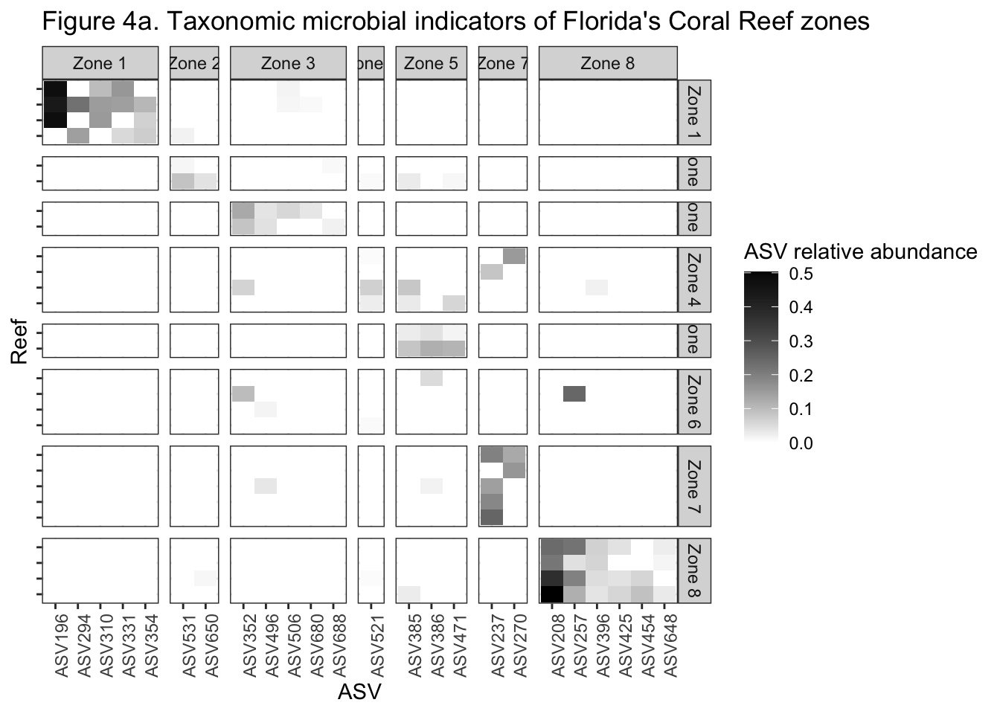
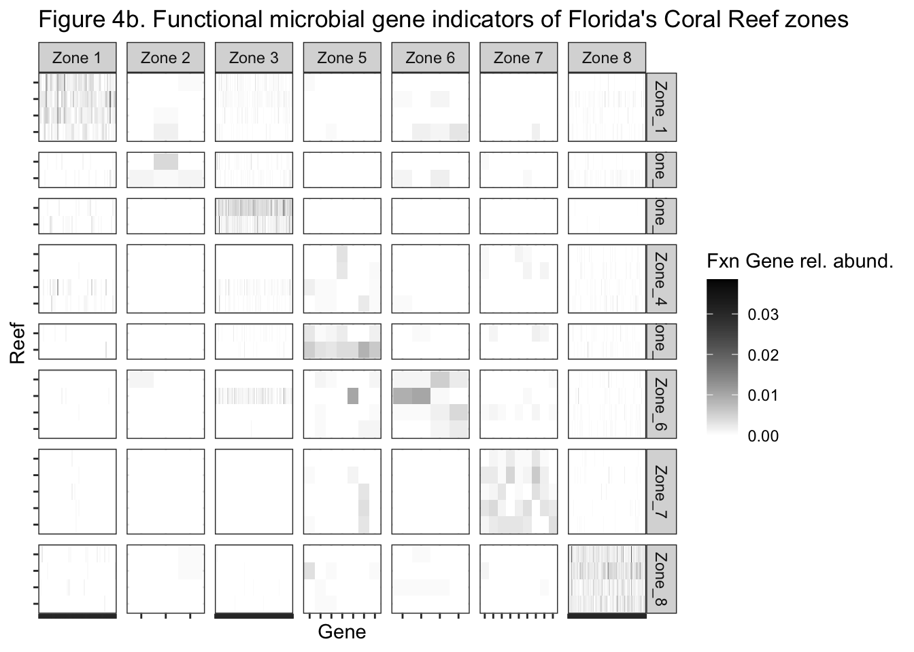

# Setup

## Install necessary packages


```r
# For data wrangling and stats tests
library(readxl); packageVersion("readxl")
library(tidyverse); packageVersion("tidyverse")

# For indicator analysis
library(indicspecies); packageVersion("indicspecies")

# For visualization
library(ggplot2); packageVersion("ggplot2")
theme_set(theme_bw())
```

## Read in prepped data

These tables are required for the subsequent analyses. Load **all** of them prior to generating figures. These tables are generated by the `Code_to_prep_data` document found at **THIS LINK NEEDS TO BE ADDED**. 

Taxonomic microbiome data (16S rRNA gene abundances)
Import the data that has been filtered for contaminants and low abundance reads

```r
ASV_16S <- read.table("data/ASV_MiSeq_nochloromito.filt.txt", 
                      sep = "\t", row.names = 1, header = TRUE)
taxa_16S <- as.matrix(read.table("data/taxonomy_MiSeq_nochloromito.filt.txt", 
                                 sep = "\t", row.names = 1, header = TRUE))
metadata_16S <- read.table("data/metadata_MiSeq_16S.txt", sep = "\t", header = TRUE)

#remove controls
metadata_16S <- metadata_16S %>%
  filter(!is.na(ZoneNum))
```

Functional metagenome data (shotgun metagenomics)
Import the data that has already been low-abundance filtered

```r
count_MG <- read.delim("data/Fxn_Count_low-abund-filt.txt", 
                       sep = "\t", header = TRUE, row.names = 1)
colnames(count_MG) <- str_replace_all(colnames(count_MG), pattern = "[X]", "") #remove the X from column names

fxns_MG <- as.matrix(read.table("data/Fxn_low-abund-filt.txt", 
                                sep = "\t", row.names = 1, header = TRUE, na.strings = "NA"))
metadata_MG <- read.table("data/Fxn_metadata-filt.txt", 
                          sep = "\t", header = TRUE, row.names = 1)
class(metadata_MG$Sample) <- "character"
```

## Generate functions used in analysis

```r
#For Bray-Curtis NMDS, write a function that will turn data into relatuve abundances
relabund <- function(sample) {
  x = sample/sum(sample)
  x = x*100
  return(x)
}
```

# Figure 4

**Indicator microbial taxa and functional genes across Florida’s Coral Reef zones.**

**Figure 4.** a) Relative abundance across all reefs of amplicon sequence variants (ASVs) diagnostic of individual reef zones, and ASV identifier on the x-axis. b) Relative abundance across all reefs of bacterial functional genes diagnostic of individual reef zones. Number of functional genes indicative in each grouping labeled on x axis, with full summary of genes in Supplementary File 3. All indicator taxa and functional genes determined by indicator value analysis (A ≥ 0.6, B ≥ 0.6, p < 0.05). Taxa and functional genes are grouped by the associated zone they are indicative of, which is boxed in the zone color within the heatmaps.

## Figure 4a.

```r
#create the zone groups for the indicspecies analysis
zone = metadata_16S$Zone

#Remove the samples from the ASV table that are no longer represented in the metadata tibble
idx <- match(metadata_16S$Sample, rownames(ASV_16S))
ASV.sw <- ASV_16S[idx, ]

ASV.sw <- apply(ASV.sw, 1, relabund) #Apply the relative abundance function to each row (sample) in the ASV data frame
ASV.sw <- ASV.sw[rowSums(ASV.sw) != 0, ] #get rid of ASVs that have no abundance in any samples
ASV.sw <- t(ASV.sw) #make sure sample names are rows

ASV.sw.log <- log(ASV.sw+1) #Log transform the relative abundance data, where I add a 1 pseudocount to everything

#do actual indval analysis - commented out because it takes a while to run and knit
#indvalmiseq = multipatt(ASV.sw.log, zone, control = how(nperm=999))

#Visualize results at certain p-value, A, and B, cutoffs - shown below because it is a long output
# summary(indvalmiseq, indvalcomp=TRUE, alpha = 0.05, A = 0.6, B = 0.6) 

#COPIED AND PASTED RESULTS INTO AN EXCEl DOCUMENT AND READ BACK IN - PROVIDED IN REPO
IndicatorASVs <- read_xlsx("data/16S_IndVal_Results_byZone.xlsx")

#Add abundance and taxonomy information so you can graph the indicator genes
ASV.sw <- as.data.frame(t(ASV.sw))
ASV.sw$asv <- rownames(ASV.sw)
taxa_16S <- as.data.frame(taxa_16S)
taxa_16S$Species <- rownames(taxa_16S)

IndicatorASVsForGraph <- IndicatorASVs %>%
  left_join(ASV.sw, by = c("ASV" = "asv")) %>% #add in relative abundance
  left_join(taxa_16S, by = c("ASV" = "Species")) %>% #add in functional info
  gather(key = "Site", value = "RelativeAbundance", 7:63) %>% #make long format
  mutate(TaxLong = paste(Class, Order, Family, Genus, ASV, sep = "_")) %>% #add column with concatenated fxn infos
  left_join(metadata_16S, by = c("Site" = "Sample")) #add in site-specific metadata

ggplot(IndicatorASVsForGraph, aes(x = ASV, y = stationID, fill = RelativeAbundance)) +
  geom_tile() +
  facet_grid(ZoneNum ~ IndicatorZone, scales = "free", space = "free") +
  scale_fill_gradient(low="white", high="black") +
  theme(axis.text.x = element_text(angle = 90, hjust = 1), 
        axis.text.y = element_blank()) +
  labs(y = "Reef", fill = "ASV relative abundance", title = "Figure 4a. Taxonomic microbial indicators of Florida's Coral Reef zones")
```



## Figure 4b.

```r
count_MG <- as.matrix(t(count_MG)) #make samples rows
countRA <- apply(count_MG, 1, relabund) #Apply the relative abundance function to each row (sample) in the count data frame
countRA <- t(countRA) #make sure sample names are rows
log.countRA <- log(countRA+1) #Log transform the realtive abundance data to variance stabilize it, where I add a 1 pseudocount to everything

MG_zone = metadata_MG$Zone

# do actual indval analysis - commented out to make code run more quickly
# indvalNextSeq = multipatt(log.countRA, zone, control = how(nperm=999))

# Look at results at certain p-value, A, and B, cutoffs - shown below because it is a long output
# summary(indvalNextSeq, indvalcomp=TRUE, alpha = 0.05, A = 0.6, B = 0.6) 

#COPY AND PASTE RESULTS INTO AN EXCEl DOCUMENT AND READ BACK IN
IndicatorFxns <- read_xlsx("data/Fxn_IndVal_Results_byZone.xlsx")

#Add abundance and taxonomy information so you can graph the indicator genes
countRA2 <- as.data.frame(t(countRA))
countRA2$Gene <- rownames(countRA2)
fxns2 <- as.data.frame(fxns_MG)

IndicatorFxnsForGraph <- IndicatorFxns %>%
  left_join(countRA2, by = "Gene") %>% #add in relative abundance
  left_join(fxns2, by = c("Gene" = "Genus")) %>% #add in functional info
  gather(key = "Site", value = "RelativeAbundance", 8:54) %>% #make long format
  mutate(FxnLong = paste(Phylum, Order, Family, sep = "_")) %>% #add column with concatenated fxn infos
  left_join(metadata_MG, by = c("Site" = "Sample")) #add in site-specific metadata

ggplot(IndicatorFxnsForGraph, aes(x = Gene, y = stationID, fill = RelativeAbundance)) +
  geom_tile() +
  facet_grid(ZoneNum ~ ZoneIndicator, scales = "free", space = "free_y") +
  scale_fill_gradient(low="white", high="black") +
  theme(axis.text=element_blank()) +
  labs(y = "Reef", fill = "Fxn Gene rel. abund.", title = "Figure 4b. Functional microbial gene indicators of Florida's Coral Reef zones")
```



```r
#Write out a table with the taxonomic info and results
IndicatorFxnsTOSAVE <- IndicatorFxns %>%
  left_join(fxns2, by = c("Gene" = "Genus"))
#write.table(IndicatorFxnsTOSAVE, "IndVal_FxnGenes_Zone_Resulst_WithPathways.txt", sep = "\t")
```

### Indicator analysis results
**Note:** This is commented out because it takes a while to run the original `multipatt` code in the previous chunks. 

```r
#Look at results at certain p-value, A, and B, cutoffs - shown below because it is a long output
# summary(indvalmiseq, indvalcomp=TRUE, alpha = 0.05, A = 0.6, B = 0.6) 

#Look at results at certain p-value, A, and B, cutoffs - shown below because it is a long output
# summary(indvalNextSeq, indvalcomp=TRUE, alpha = 0.05, A = 0.6, B = 0.6) 
```

# References - R Packages used

```r
knitr::write_bib()
```

```
## Warning in utils::citation(..., lib.loc = lib.loc): no date field in DESCRIPTION
## file of package 'tidyr'
```

```
## @Manual{R-base,
##   title = {R: A Language and Environment for Statistical Computing},
##   author = {{R Core Team}},
##   organization = {R Foundation for Statistical Computing},
##   address = {Vienna, Austria},
##   year = {2022},
##   url = {https://www.R-project.org/},
## }
## 
## @Manual{R-dplyr,
##   title = {dplyr: A Grammar of Data Manipulation},
##   author = {Hadley Wickham and Romain François and Lionel Henry and Kirill Müller and Davis Vaughan},
##   year = {2023},
##   note = {R package version 1.1.0},
##   url = {https://CRAN.R-project.org/package=dplyr},
## }
## 
## @Manual{R-forcats,
##   title = {forcats: Tools for Working with Categorical Variables (Factors)},
##   author = {Hadley Wickham},
##   year = {2023},
##   note = {R package version 1.0.0},
##   url = {https://CRAN.R-project.org/package=forcats},
## }
## 
## @Manual{R-ggplot2,
##   title = {ggplot2: Create Elegant Data Visualisations Using the Grammar of Graphics},
##   author = {Hadley Wickham and Winston Chang and Lionel Henry and Thomas Lin Pedersen and Kohske Takahashi and Claus Wilke and Kara Woo and Hiroaki Yutani and Dewey Dunnington},
##   year = {2022},
##   note = {R package version 3.4.0},
##   url = {https://CRAN.R-project.org/package=ggplot2},
## }
## 
## @Manual{R-indicspecies,
##   title = {indicspecies: Relationship Between Species and Groups of Sites},
##   author = {Miquel {De Cáceres} and Florian Jansen and Noah Dell},
##   year = {2022},
##   note = {R package version 1.7.12},
##   url = {https://emf-creaf.github.io/indicspecies/},
## }
## 
## @Manual{R-permute,
##   title = {permute: Functions for Generating Restricted Permutations of Data},
##   author = {Gavin L. Simpson},
##   year = {2022},
##   note = {R package version 0.9-7},
##   url = {https://github.com/gavinsimpson/permute},
## }
## 
## @Manual{R-purrr,
##   title = {purrr: Functional Programming Tools},
##   author = {Hadley Wickham and Lionel Henry},
##   year = {2023},
##   note = {R package version 1.0.1},
##   url = {https://CRAN.R-project.org/package=purrr},
## }
## 
## @Manual{R-readr,
##   title = {readr: Read Rectangular Text Data},
##   author = {Hadley Wickham and Jim Hester and Jennifer Bryan},
##   year = {2022},
##   note = {R package version 2.1.3},
##   url = {https://CRAN.R-project.org/package=readr},
## }
## 
## @Manual{R-readxl,
##   title = {readxl: Read Excel Files},
##   author = {Hadley Wickham and Jennifer Bryan},
##   year = {2022},
##   note = {R package version 1.4.1},
##   url = {https://CRAN.R-project.org/package=readxl},
## }
## 
## @Manual{R-stringr,
##   title = {stringr: Simple, Consistent Wrappers for Common String Operations},
##   author = {Hadley Wickham},
##   year = {2022},
##   note = {R package version 1.5.0},
##   url = {https://CRAN.R-project.org/package=stringr},
## }
## 
## @Manual{R-tibble,
##   title = {tibble: Simple Data Frames},
##   author = {Kirill Müller and Hadley Wickham},
##   year = {2022},
##   note = {R package version 3.1.8},
##   url = {https://CRAN.R-project.org/package=tibble},
## }
## 
## @Manual{R-tidyr,
##   title = {tidyr: Tidy Messy Data},
##   author = {Hadley Wickham and Davis Vaughan and Maximilian Girlich},
##   year = {2023},
##   note = {https://tidyr.tidyverse.org},
## }
## 
## @Manual{R-tidyverse,
##   title = {tidyverse: Easily Install and Load the Tidyverse},
##   author = {Hadley Wickham},
##   year = {2022},
##   note = {R package version 1.3.2},
##   url = {https://CRAN.R-project.org/package=tidyverse},
## }
## 
## @Book{ggplot22016,
##   author = {Hadley Wickham},
##   title = {ggplot2: Elegant Graphics for Data Analysis},
##   publisher = {Springer-Verlag New York},
##   year = {2016},
##   isbn = {978-3-319-24277-4},
##   url = {https://ggplot2.tidyverse.org},
## }
## 
## @Manual{indicspecies2009,
##   title = {Associations between species and groups of sites: indices and statistical inference},
##   author = {Miquel {De Caceres} and Pierre Legendre},
##   journal = {Ecology},
##   year = {2009},
##   url = {http://sites.google.com/site/miqueldecaceres/},
## }
## 
## @Article{tidyverse2019,
##   title = {Welcome to the {tidyverse}},
##   author = {Hadley Wickham and Mara Averick and Jennifer Bryan and Winston Chang and Lucy D'Agostino McGowan and Romain François and Garrett Grolemund and Alex Hayes and Lionel Henry and Jim Hester and Max Kuhn and Thomas Lin Pedersen and Evan Miller and Stephan Milton Bache and Kirill Müller and Jeroen Ooms and David Robinson and Dana Paige Seidel and Vitalie Spinu and Kohske Takahashi and Davis Vaughan and Claus Wilke and Kara Woo and Hiroaki Yutani},
##   year = {2019},
##   journal = {Journal of Open Source Software},
##   volume = {4},
##   number = {43},
##   pages = {1686},
##   doi = {10.21105/joss.01686},
## }
```
