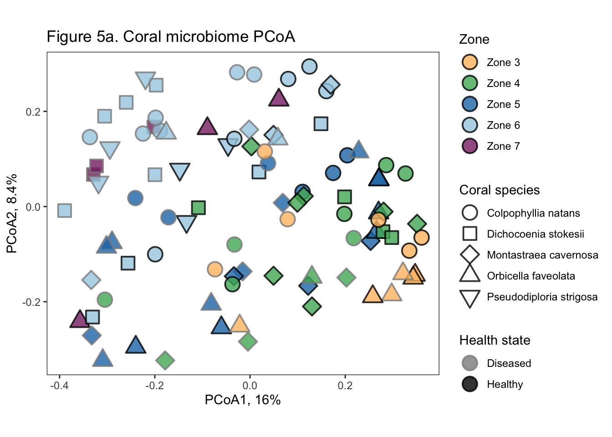
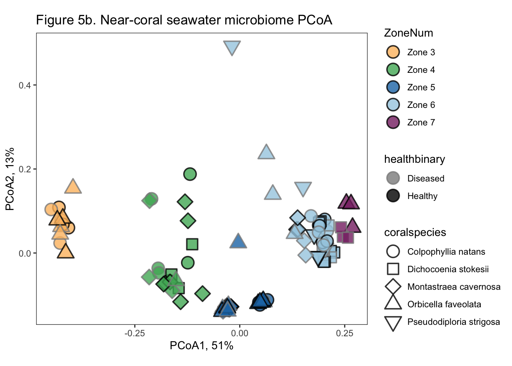
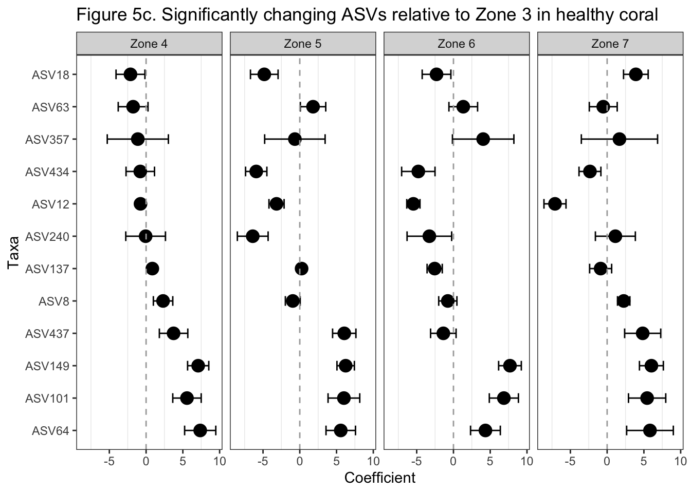

# Setup
## Install necessary packages


```r
# For data wrangling
library(dplyr); packageVersion("dplyr")
library(tidyr); packageVersion("tidyr")
library(knitr); packageVersion("knitr")

# For microbiome/metagenome analysis
library(corncob); packageVersion("corncob")
library(vegan); packageVersion("vegan")
library(phyloseq); packageVersion("phyloseq")
library(speedyseq); packageVersion("speedyseq")

# For visualization
library(ggplot2); packageVersion("ggplot2")
theme_set(theme_bw())
```

## Read in prepped data

Read in the data that have been filtered for contaminants and low abundance reads. Create phyloseq object that is needed for the analysis


```r
#Upload data
#import the ASV data that has been filtered for contaminants and low abundance reads. 
ASV <- read.table("data/Coral_ASV_nochloromito.filt.txt", sep = "\t", row.names = 1, header = TRUE)
taxa <- as.matrix(read.table("data/Coral_taxonomy_nochloromito.filt.txt", sep = "\t", row.names = 1, header = TRUE))
metadata <- read.table("data/Coral_metadata_nochloromito.filt.txt", sep = "\t", header = TRUE)

#upload the metadata in a different format for phyloseq
metadataPS <- read.table("data/Coral_metadata_nochloromito.filt.txt", sep = "\t", header = TRUE, row.names = 1)
```

## Functions for analysis

```r
relabund <- function(sample) { #Write a relative abundance function
  x = sample/sum(sample)
  x = x*100
  return(x)
}
```


# Figure 5. 

**Coral and near-coral seawater taxonomic microbiomes are influenced by biogeography.**

**Figure 5.** Principal coordinates analysis (PCoA) of (a) coral and (b) near-coral seawater taxonomic microbiome beta diversity (Bray-Curtis dissimilarity). Results from a permutational analysis of variance (PERMANOVA) displayed above each graph indicate coral microbiomes are significantly different across zones, coral species, and between apparently healthy and diseased corals, while near-coral seawater microbiomes are significantly different across zones and coral species (p < 0.05). C) 12 amplicon sequence variants (ASVs) significantly differed relative to zone 3, within apparently healthy coral microbiomes as identified by differential abundance tests (Benjamini-Hochberg adjusted p < 0.05, see SI methods). 

## Figure 5a

Visualize beta diversity using Bray-Curtis dissimilarity of coral tissue microbiomes. Evaluate how zone, coral species and disease influences the structure of coral microbial beta diversity by running a PERMANOVA. 

```r
#Adjust the metadata to have no coral samples
meta_coral <- metadata %>%
  filter(coralspecies != "Control") %>%
  filter(sampletype == "Tissue") %>%
  filter(coral != "SSID")

#Remove the samples from the ASV table that are no longer represented in the metadata tibble
idx <- match(meta_coral$X.1, rownames(ASV))
ASV.coral <- ASV[idx, ]

ASV.coral <- apply(ASV.coral, 1, relabund) #Apply the relative abundance function to each row (sample) in the ASV data frame
ASV.coral <- ASV.coral[rowSums(ASV.coral) != 0, ] #get rid of ASVs that have no abundance in any samples
ASV.coral <- t(ASV.coral) #make sure sample names are rows
ASV.coral.log <- log(ASV.coral+1) #Log transform the realtive abundance data, where I add a 1 pseudocount to everything


#Helpful reference - http://r-sig-ecology.471788.n2.nabble.com/Variability-explanations-for-the-PCO-axes-as-in-Anderson-and-Willis-2003-td6429547.html
ASV.coral.log.b <- vegdist(ASV.coral.log, "bray") #calculate bray curtis dissimilarity
pcoa.coral <- cmdscale(ASV.coral.log.b, k=(3), eig=TRUE) #metric dimensional scaling (principal coordinates analysis) - #warning = only 47 of the first 48 eigenvalues are > 0

#take a look at what principal coordinates best explain the data. There is a small difference between 2 and 3, so also plot principal coordinates 2 and 3.
# barplot(pcoa.coral$eig)
pcoa.eig <- eigenvals(pcoa.coral) #extract eigenvalues
Variance <- pcoa.eig / sum(pcoa.eig) #calculate the percent of variance explained by each axis
Variance1a <- 100 * signif(Variance[1], 2) #extract percent explained by variance 1
Variance2a <- 100 * signif(Variance[2], 2) #extract percent explained by variance 2
  
#GGPLOT2 plotting
pcoa.coral2 <- cbind(pcoa.coral$points, meta_coral) # combine the Pcoa values with metadata for easier plotting

ggplot(pcoa.coral2, aes(x = pcoa.coral2[,1]*(-1), y = pcoa.coral2[,2], fill = ZoneNum, shape = coralspecies, color = healthbinary)) +
  geom_point(size = 5, alpha = 0.8, stroke = 1) +
  coord_fixed() + #aspect ratio of 1
  labs(x = paste0("PCoA1, ", Variance1a, "%"), y = paste0("PCoA2, ",Variance2a, "%"), 
       shape = "Coral species", color = "Health state", fill = "Zone", 
       title = "Figure 5a. Coral microbiome PCoA") +
  guides(fill = guide_legend(override.aes=list(shape=21))) +
  #theme(legend.position = "none") +
  scale_shape_manual(values = c(21, 22, 23, 24, 25)) +
  scale_fill_manual(values = c("#FDBF6F", "#4EB265", "#1F78B4", "#A6CEE3", "#882E72")) +
  scale_color_manual(labels = c("Diseased", "Healthy"), values = c("gray55", "black")) +
  theme(plot.background = element_blank(),
    panel.grid.major = element_blank(),
    panel.grid.minor = element_blank())
```



```r
# PERMANOVA
# Goal: Analyze the effect of zone, health state, and coral species on coral tissue microbiome structure
zone<-adonis2(ASV.coral.log.b ~ ZoneNum, meta_coral) #So we can clearly see that There is a slightly significant (p = 0.03) effect of site on structuring coral microbiomes
zone
```

```
## Permutation test for adonis under reduced model
## Terms added sequentially (first to last)
## Permutation: free
## Number of permutations: 999
## 
## adonis2(formula = ASV.coral.log.b ~ ZoneNum, data = meta_coral)
##          Df SumOfSqs      R2      F Pr(>F)    
## ZoneNum   4   4.8489 0.16999 4.6081  0.001 ***
## Residual 90  23.6755 0.83001                  
## Total    94  28.5244 1.00000                  
## ---
## Signif. codes:  0 '***' 0.001 '**' 0.01 '*' 0.05 '.' 0.1 ' ' 1
```

```r
disease<-adonis2(ASV.coral.log.b ~ healthbinary, meta_coral) #Looks like healthstate has a signifcant influence on the structuring of microbial communities in coral tissue. I also find it interesting that this effect isstronger than the effect of site on these communities. 
disease
```

```
## Permutation test for adonis under reduced model
## Terms added sequentially (first to last)
## Permutation: free
## Number of permutations: 999
## 
## adonis2(formula = ASV.coral.log.b ~ healthbinary, data = meta_coral)
##              Df SumOfSqs      R2      F Pr(>F)    
## healthbinary  1   1.8252 0.06399 6.3577  0.001 ***
## Residual     93  26.6992 0.93601                  
## Total        94  28.5244 1.00000                  
## ---
## Signif. codes:  0 '***' 0.001 '**' 0.01 '*' 0.05 '.' 0.1 ' ' 1
```

```r
species <- adonis2(ASV.coral.log.b ~ coral, meta_coral) #Condition is also signfiicant, indicating that there is a significant difference between healthy corals without SCTLD, healthy tissue on SCTLD-afflicted corals, and tissue with SCTLD.
species
```

```
## Permutation test for adonis under reduced model
## Terms added sequentially (first to last)
## Permutation: free
## Number of permutations: 999
## 
## adonis2(formula = ASV.coral.log.b ~ coral, data = meta_coral)
##          Df SumOfSqs      R2      F Pr(>F)    
## coral     4   3.0113 0.10557 2.6557  0.001 ***
## Residual 90  25.5131 0.89443                  
## Total    94  28.5244 1.00000                  
## ---
## Signif. codes:  0 '***' 0.001 '**' 0.01 '*' 0.05 '.' 0.1 ' ' 1
```

## Figure 5b

Visualize beta diversity using Bray-Curtis dissimilarity of near-coral seawater microbiomes. Evaluate how zone, coral species and disease influences the structure of coral microbial beta diversity by running a PERMANOVA. 

```r
#Adjust the metadata to have no coral samples
meta_sw <- metadata %>%
  filter(coralspecies != "Control") %>%
  filter(sampletype == "Ecosphere")

#Remove the samples from the ASV table that are no longer represented in the metadata tibble
idx <- match(meta_sw$X.1, rownames(ASV))
ASV.sw <- ASV[idx, ]

ASV.sw <- apply(ASV.sw, 1, relabund) #Apply the relative abundance function to each row (sample) in the ASV data frame
ASV.sw <- ASV.sw[rowSums(ASV.sw) != 0, ] #get rid of ASVs that have no abundance in any samples
ASV.sw <- t(ASV.sw) #make sure sample names are rows
ASV.sw.log <- log(ASV.sw+1) #Log transform the realtive abundance data, where I add a 1 pseudocount to everything


#Helpful reference - http://r-sig-ecology.471788.n2.nabble.com/Variability-explanations-for-the-PCO-axes-as-in-Anderson-and-Willis-2003-td6429547.html
ASV.sw.log.b <- vegdist(ASV.sw.log, "bray") #calculate bray curtis dissimilarity
pcoa.sw <- cmdscale(ASV.sw.log.b, k=(3), eig=TRUE) #metric dimensional scaling (principal coordinates analysis) - #warning = only 47 of the first 48 eigenvalues are > 0

#take a look at what principal coordinates best explain the data. There is a small difference between 2 and 3, so also plot principal coordinates 2 and 3.
# barplot(pcoa.sw$eig) 
pcoa.eig <- eigenvals(pcoa.sw) #extract eigenvalues
Variance <- pcoa.eig / sum(pcoa.eig) #calculate the percent of variance explained by each axis
Variance1b <- 100 * signif(Variance[1], 2) #extract percent explained by variance 1
Variance2b <- 100 * signif(Variance[2], 2) #extract percent explained by variance 2
  
#GGPLOT2 plotting
pcoa.sw2 <- cbind(pcoa.sw$points, meta_sw) # combine the Pcoa values with metadata for easier plotting

# add disease information
ggplot(pcoa.sw2, aes(x = pcoa.sw2[,1]*(-1), y = pcoa.sw2[,2], fill = ZoneNum, shape = coralspecies, color = healthbinary)) +
  geom_point(size = 5, stroke = 1, alpha = 0.8) +
  coord_fixed() + #aspect ratio of 1
  labs(x = paste0("PCoA1, ", Variance1b, "%"), y = paste0("PCoA2, ",Variance2b, "%"), 
       title = "Figure 5b. Near-coral seawater microbiome PCoA") +
  guides(fill = guide_legend(override.aes=list(shape=21))) +
 # theme(legend.position = "none") +
  scale_shape_manual(values = c(21, 22, 23, 24, 25)) +
  scale_fill_manual(values = c("#FDBF6F", "#4EB265", "#1F78B4", "#A6CEE3", "#882E72")) +
  scale_color_manual(labels = c("Diseased", "Healthy"), values = c("gray55", "black")) +
  theme(plot.background = element_blank(),
    panel.grid.major = element_blank(),
    panel.grid.minor = element_blank())
```



```r
# PERMANOVA
# Goal: Analyze the effect of zone, health state, and coral species on coral tissue microbiome structure
zone.sw <-adonis2(ASV.sw.log.b ~ ZoneNum, meta_sw) #So we can clearly see that There is a slightly significant (p = 0.03) effect of site on structuring coral microbiomes
zone.sw
```

```
## Permutation test for adonis under reduced model
## Terms added sequentially (first to last)
## Permutation: free
## Number of permutations: 999
## 
## adonis2(formula = ASV.sw.log.b ~ ZoneNum, data = meta_sw)
##           Df SumOfSqs     R2      F Pr(>F)    
## ZoneNum    4   5.5870 0.6595 46.485  0.001 ***
## Residual  96   2.8845 0.3405                  
## Total    100   8.4715 1.0000                  
## ---
## Signif. codes:  0 '***' 0.001 '**' 0.01 '*' 0.05 '.' 0.1 ' ' 1
```

```r
disease.sw <-adonis2(ASV.sw.log.b ~ healthbinary, meta_sw) #Looks like healthstate has a signifcant influence on the structuring of microbial communities in coral tissue. I also find it interesting that this effect isstronger than the effect of site on these communities. 
disease.sw
```

```
## Permutation test for adonis under reduced model
## Terms added sequentially (first to last)
## Permutation: free
## Number of permutations: 999
## 
## adonis2(formula = ASV.sw.log.b ~ healthbinary, data = meta_sw)
##               Df SumOfSqs      R2      F Pr(>F)
## healthbinary   1   0.1056 0.01247 1.2497  0.244
## Residual      99   8.3659 0.98753              
## Total        100   8.4715 1.00000
```

```r
species.sw <- adonis2(ASV.sw.log.b ~ coral, meta_sw) #Condition is also signfiicant, indicating that there is a significant difference between healthy corals without SCTLD, healthy tissue on SCTLD-afflicted corals, and tissue with SCTLD.
species.sw
```

```
## Permutation test for adonis under reduced model
## Terms added sequentially (first to last)
## Permutation: free
## Number of permutations: 999
## 
## adonis2(formula = ASV.sw.log.b ~ coral, data = meta_sw)
##           Df SumOfSqs      R2      F Pr(>F)    
## coral      4   1.1903 0.14051 3.9235  0.001 ***
## Residual  96   7.2812 0.85949                  
## Total    100   8.4715 1.00000                  
## ---
## Signif. codes:  0 '***' 0.001 '**' 0.01 '*' 0.05 '.' 0.1 ' ' 1
```

## Figure 5c

Use corncob to identify ASVs that were significantly differentially abundant across zones within healthy coral tissue.

```r
# Make a phyloseq object. Corncob works with these. 
ASV = otu_table(ASV, taxa_are_rows = FALSE)
TAX = tax_table(taxa)
META = sample_data(metadataPS)

ps <- phyloseq(ASV, TAX, META)

# Add an ASV column
ps <- ps %>% 
  mutate_tax_table(ASV = .otu)

#Identify ASVs that are in >90% of SW samples and remove from coral samples
sw.taxa90 <- ps %>%
  subset_samples(sworcoral == "Near-coral seawater") %>%
  filter_taxa(function(x) sum(x>0) > (0.9*length(x)), prune = TRUE) %>% 
  tax_table() %>%
  as.data.frame()

sw.contaminants <- rownames(sw.taxa90) #make a list of the highly prevalent (>90% of samples) seawater ASVs 

taxa.90 <- as.data.frame(tax_table(ps))
taxa.90$prev90 <- taxa.90$ASV %in% sw.contaminants #list contaminatns

ps.coral.filt <- ps %>%
  prune_taxa(!taxa.90$prev90, .) %>% #remove highly prevalent sw taxa 
  subset_samples(sworcoral == "Coral") %>% #subset coral samples
  subset_samples(coral != "SSID") %>% #remove ssid from analysis
  subset_samples(healthbinary == "H")

set.seed(100) # set seed for reproducibility

coral2 <- differentialTest(formula = ~ ZoneNum + coral, 
                             phi.formula = ~ ZoneNum + coral,
                             formula_null = ~ coral,
                             phi.formula_null = ~ ZoneNum + coral,
                             test = "Wald", boot = FALSE,
                             data = ps.coral.filt,
                             fdr_cutoff = 0.05)

#NEXT - REORDER THIS GRAPH FOR PLOTTING IN PAPER
# Reorder to this: c("ASV64", "ASV101", "ASV149", "ASV437", "ASV8", "ASV137", "ASV240", "ASV12", "ASV434", "ASV357", "ASV63", "ASV18")

sigtaxa <- as.vector(coral2$significant_taxa)

sig.coral.asvs <- c()
for(i in 1:length(sigtaxa)) {
  modelresults <- data.frame("ASV" = rep(sigtaxa[i], 4), 
                             coral2$significant_models[[i]]$coefficients[2:5,1:2], 
                             "Zone" = c("Zone 4", "Zone 5", "Zone 6", "Zone 7"))
  sig.coral.asvs <- rbind(sig.coral.asvs, modelresults)
}

tax_table(ps.coral.filt)[,7] <- rownames(tax_table(ps.coral.filt))
sig.taxonomy <- as.data.frame(tax_table(subset_taxa(ps.coral.filt, Species %in% sigtaxa))) #extract the taxonomy information
sig.taxonomy$Genus[is.na(sig.taxonomy$Genus)] <- "unclassified"

sig.coral.asvs.taxa <- sig.coral.asvs %>%
  left_join(sig.taxonomy, by = c("ASV" = "Species")) %>%
  mutate(ASV = factor(ASV, levels = c("ASV64", "ASV101", "ASV149", "ASV437", 
                                      "ASV8", "ASV137", "ASV240", "ASV12", 
                                      "ASV434", "ASV357", "ASV63", "ASV18"))) %>%
  mutate(genusasv = paste0(Genus, " (", ASV,")"))

# Plot results
ggplot(sig.coral.asvs.taxa, aes(x = ASV, y = Estimate)) +
  geom_errorbar(aes(ymin = Estimate-Std..Error, ymax = Estimate+Std..Error), 
                color = "black", width = .3, position=position_dodge(.9)) +
  geom_point(size = 4, pch = 21, fill = "black") +
  geom_line() +
  coord_flip() +
  theme_bw() +
  facet_grid(. ~ Zone) +
  #scale_fill_brewer(palette = "Paired") +
  labs(x = "Taxa", y = "Coefficient", title = "Figure 5c. Significantly changing ASVs relative to Zone 3 in healthy coral") +
  geom_hline(yintercept = 0, linetype = "dashed", color = "darkgray") +
  theme(plot.background = element_blank(),
  panel.grid.major = element_blank())
```



```r
# Print the taxonomic assignments
kable(sig.taxonomy[,2:7])
```


|       |Phylum            |Class               |Order              |Family           |Genus                        |Species |
|:------|:-----------------|:-------------------|:------------------|:----------------|:----------------------------|:-------|
|ASV8   |Proteobacteria    |Gammaproteobacteria |Pseudomonadales    |Moraxellaceae    |Acinetobacter                |ASV8    |
|ASV12  |Proteobacteria    |Alphaproteobacteria |SAR11 clade        |Clade III        |unclassified                 |ASV12   |
|ASV18  |Proteobacteria    |Gammaproteobacteria |Alteromonadales    |Alteromonadaceae |Alteromonas                  |ASV18   |
|ASV63  |Firmicutes        |Clostridia          |Clostridiales      |Clostridiaceae   |unclassified                 |ASV63   |
|ASV64  |Verrucomicrobiota |Verrucomicrobiae    |Verrucomicrobiales |Rubritaleaceae   |Rubritalea                   |ASV64   |
|ASV101 |Desulfobacterota  |Desulfobulbia       |Desulfobulbales    |Desulfocapsaceae |unclassified                 |ASV101  |
|ASV137 |Bacteroidota      |Rhodothermia        |Balneolales        |Balneolaceae     |Balneola                     |ASV137  |
|ASV149 |Myxococcota       |Polyangia           |Polyangiales       |Sandaracinaceae  |unclassified                 |ASV149  |
|ASV240 |Proteobacteria    |Alphaproteobacteria |Rickettsiales      |S25-593          |unclassified                 |ASV240  |
|ASV357 |Proteobacteria    |Gammaproteobacteria |Alteromonadales    |Moritellaceae    |Paramoritella                |ASV357  |
|ASV434 |Planctomycetota   |Planctomycetes      |Pirellulales       |Pirellulaceae    |unclassified                 |ASV434  |
|ASV437 |Firmicutes        |Clostridia          |Clostridiales      |Clostridiaceae   |Clostridium sensu stricto 16 |ASV437  |
