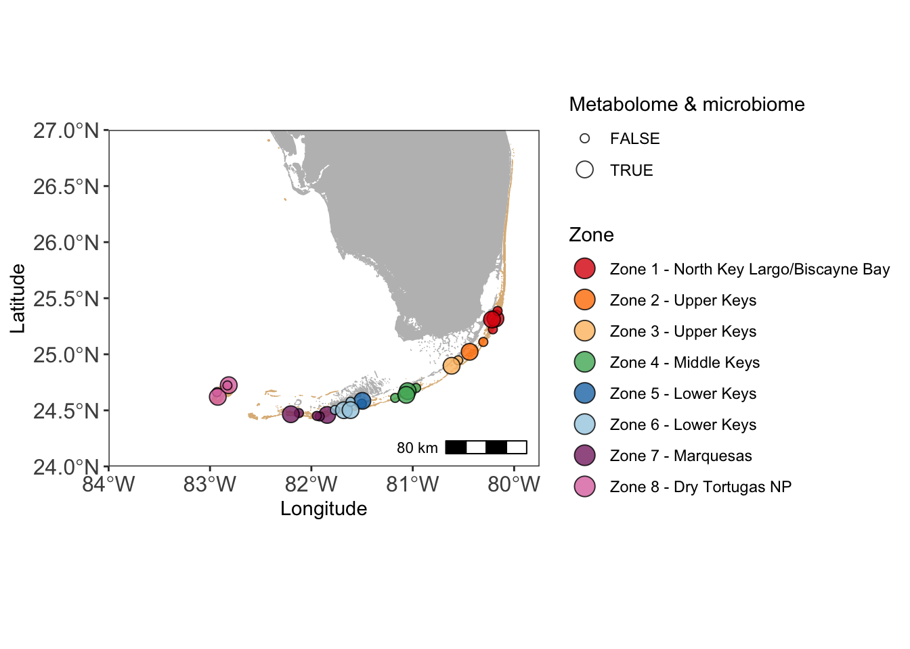
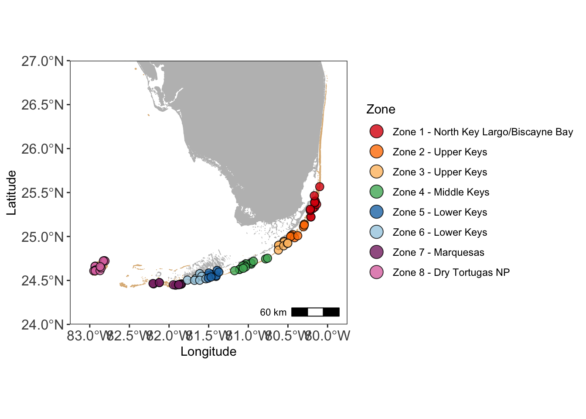
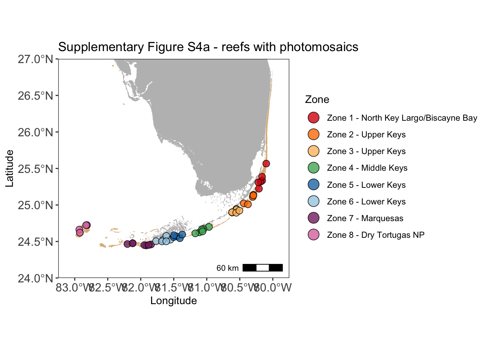

# Setup
### Install necessary packages


```r
# For Maps
library(sf); packageVersion("sf")
library(ggspatial); packageVersion("ggspatial")

# For data wrangling
library(dplyr); packageVersion("dplyr")
library(tidyverse); packageVersion("tidyverse")
library(lubridate); packageVersion("lubridate")

# For microbiome/metagenome analysis
library(vegan); packageVersion("vegan")

# For visualization
library(ggplot2); packageVersion("ggplot2")
theme_set(theme_bw()) # get rid of the gray background
```

### Read in prepped data

These tables are required for the subsequent analyses. Load **all** of them prior to generating figures. These tables are generated by the `Code_to_prep_data` document found at **THIS LINK NEEDS TO BE ADDED**. 

The shapefiles for making the map can be downloaded at the following links:
United States and Territories <https://earthworks.stanford.edu/catalog/stanford-vt021tk4894> 
Florida Hard Bottom and Coral Habitats <https://geodata.myfwc.com/datasets/myfwc::coral-and-hard-bottom-habitats-in-florida/about>


```r
# read in general metadata
metadata <- read.table("data/FLK2019_environmental_data_for_R.txt", sep = "\t", header = TRUE)

# path to the shapefiles. Download the shapefiles linked above and change the path to use this code
usa <- st_read("~/Documents/Apprill_lab/USVI_Projects/TideExpt/USVItideGitHub/Shapefile_for_Map/", "vt021tk4894") 
fcr <- st_read("~/Google Drive (cbecker@whoi.edu) (not syncing)/Alucia 2019/Site Maps/Coral_and_Hard_Bottom_Habitats_in_Florida/")
```

Taxonomic microbiome data (16S rRNA gene abundances)
Import the data that has been filtered for contaminants and low abundance reads

```r
ASV_16S <- read.table("data/ASV_MiSeq_nochloromito.filt.txt", sep = "\t", row.names = 1, header = TRUE)
taxa_16S <- as.matrix(read.table("data/taxonomy_MiSeq_nochloromito.filt.txt", sep = "\t", row.names = 1, header = TRUE))
metadata_16S <- read.table("data/metadata_MiSeq_16S.txt", sep = "\t", header = TRUE)
```

Functional metagenome data (shotgun metagenomics)
Import the data that has already been low-abundance filtered

```r
count_MG <- read.delim("data/Fxn_Count_low-abund-filt.txt", sep = "\t", header = TRUE, row.names = 1)
colnames(count_MG) <- str_replace_all(colnames(count_MG), pattern = "[X]", "") #remove the X from column names

fxns_MG <- as.matrix(read.table("data/Fxn_low-abund-filt.txt", sep = "\t", row.names = 1, header = TRUE, na.strings = "NA"))
metadata_MG <- read.table("data/Fxn_metadata-filt.txt", sep = "\t", header = TRUE, row.names = 1)
class(metadata_MG$Sample) <- "character"
```

Targeted metabolome data
Import the data that has been corrected for extraction efficience and converted to picomolar

```r
metadata_Target_Mtb = read.table('data/Targeted_metadata.txt', header=T, sep='\t')
conc_Target_Mtb = read.table('data/Targeted_corrected_env_conc_pM.txt', header=T, sep='\t')
```

Untargeted metabolome data - positive and negative ion modes
Import the data that has been filered and normalized

```r
metab_untarg_neg <- read.table("data/Untargeted_filtered_Normalized_negative_mode.txt", sep = "\t", header = TRUE, row.names = 1)
metab_untarg_pos <- read.table("data/Untargeted_filtered_Normalized_positive_mode.txt", sep = "\t", header = TRUE, row.names = 1)
metadata_untarg_mtb <- read.table("data/Untargeted_metadata.txt", sep = "\t", header = TRUE, row.names = 1)

#reorder metadata
metadata_untarg_mtb <- metadata_untarg_mtb[match(row.names(metab_untarg_neg), row.names(metadata_untarg_mtb)),]
```


### Generate functions used in analysis

```r
#For Bray-Curtis NMDS, write a function that will turn data into relatuve abundances
relabund <- function(sample) {
  x = sample/sum(sample)
  x = x*100
  return(x)
}
```


# Maps of Florida's Coral Reef
Code to generate maps included in **Figure 1a** and **Figure 2a**. 


```r
meta27 <- filter(metadata, Microbiomes == "TRUE") #subset only the sites with microbiome samples
metabenthic <- filter(metadata, BenthicSurvey == "TRUE") #subset only the sites with benthic data

#filter out only the coral reef part of the shapefile
coral <- fcr %>% filter(DESCRIPT == "Coral Reef")

rainbowpal <- c("#DC050C", "#FF7F00", "#FDBF6F", "#4EB265", "#1F78B4", "#A6CEE3", "#882E72", "#DE77AE")

# Figure 1a
ggplot() +
  geom_sf(data = coral, fill = "burlywood", color = "burlywood") +
  geom_sf(data = usa, fill = "gray", color = "gray") +
  geom_point(data = meta27, mapping = aes(x = long, y = lat, fill = FL_region_zone, size = Metagenomes), pch = 21, alpha = 0.8) +
  coord_sf(xlim = c(-84, -79.75), ylim = c(24, 27), expand = FALSE) +
  annotation_scale(location = "br", width_hint = 0.2) +
  theme(panel.grid.major = element_blank(), panel.background = element_rect(fill = "white")) +
  labs(x = "Longitude", y = "Latitude", fill = "Zone", size = "Metabolome & microbiome", title = "Figure 1a. Reefs sampled for metagenomics and metabolomics") +
  theme(axis.text = element_text(size = 12)) +
  scale_fill_manual(values = rainbowpal) +
  scale_size_manual(values = c(2, 4)) +
  guides(fill = guide_legend(override.aes = list(size = 5)))
```



```r
# Figure 2a
ggplot() +
  geom_sf(data = coral, fill = "burlywood", color = "burlywood") +
  geom_sf(data = usa, fill = "gray", color = "gray") +
  geom_point(data = metadata, mapping = aes(x = long, y = lat, fill = FL_region_zone), pch = 21, alpha = 0.8, size = 3) +
  coord_sf(xlim = c(-83.25, -79.75), ylim = c(24, 27), expand = FALSE) +
  annotation_scale(location = "br", width_hint = 0.2) +
  theme(panel.grid.major = element_blank(), panel.background = element_rect(fill = "white")) +
  labs(x = "Longitude", y = "Latitude", fill = "Zone", title = "Figure 2a. Reefs (87) sampled for environmental data") +
  theme(axis.text = element_text(size = 12)) +
  scale_fill_manual(values = rainbowpal) +
  guides(fill = guide_legend(override.aes = list(size = 5)))
```



```r
# Supplementary Figure S4a
ggplot() +
  geom_sf(data = coral, fill = "burlywood", color = "burlywood") +
  geom_sf(data = usa, fill = "gray", color = "gray") +
  geom_point(data = metabenthic, mapping = aes(x = long, y = lat, fill = FL_region_zone), pch = 21, alpha = 0.8, size = 3) +
  coord_sf(xlim = c(-83.25, -79.75), ylim = c(24, 27), expand = FALSE) +
  annotation_scale(location = "br", width_hint = 0.2) +
  theme(panel.grid.major = element_blank(), panel.background = element_rect(fill = "white")) +
  labs(x = "Longitude", y = "Latitude", fill = "Zone", title = "Supplementary Figure S4a - reefs with photomosaics") +
  theme(axis.text = element_text(size = 12)) +
  scale_fill_manual(values = rainbowpal) +
  guides(fill = guide_legend(override.aes = list(size = 5)))
```



# Figure 1 and Table 1

**Distance-based redundancy analysis (dbRDA) reveals seawater microbiomes and metabolomes are explained by Florida’s Coral Reef biogeography and measured reef microbial and environmental parameters**

**Figure 1.** a) Map of 27 coral reefs (out of 85 reefs visited in total) sampled across 8 color-coded zones for either both seawater metabolomes and microbiomes (13 reefs) or only seawater microbiomes (27 reefs total) during June 2019. The dbRDA include (b) reef water taxonomic microbiome via 16S rRNA gene sequencing of Bacteria and Archaea, (c) functional microbiome via shotgun metagenomics, (d) targeted metabolomes, (e) untargeted metabolomes that ionized in negative mode, and (f) untargeted metabolomes that ionized in positive mode. Syn. = Synechococcus, Pro. = Prochlorococcus, Picoeuk. = picoeukaryotes, SCTLD = stony coral tissue loss disease, TOC = total organic carbon, Het. microbes = heterotrophic microbes.

### Figure 1b. Taxonomic microbiome (16S rRNA gene)

```r
#include only metadata variables you want for the dbRDA analysis
metaRDA <- metadata_16S %>%
  select(Sample, Date, dayoftrip, Zone, ZoneNum, hbact, syn, pro, peuk, npoc, Dissolved.Oxygen.at.depth.percent.sat, SCTLDprevalence, Hard_coral, Fleshy_Macroalgae, Soft_coral, Turf_Algae, Sponge) %>%
  filter(!is.na(ZoneNum)) %>%
  mutate(MA_turf = Fleshy_Macroalgae + Turf_Algae)

#Remove the samples from the ASV table that are no longer represented in the metadata tibble
idx <- match(metaRDA$Sample, rownames(ASV_16S))
ASV.sw <- ASV_16S[idx, ]

ASV.sw <- apply(ASV.sw, 1, relabund) #Apply the relative abundance function (previous chunk) to each row (sample) in the ASV data frame
ASV.sw <- ASV.sw[rowSums(ASV.sw) != 0, ] #get rid of ASVs that have no abundance in any samples
ASV.sw <- t(ASV.sw) #make sure sample names are rows
ASV.sw.log <- log(ASV.sw+1) #Log transform the realtive abundance data, where I add a 1 pseudocount to everything

set.seed(100)
dbRDA = capscale(ASV.sw.log ~ Zone + SCTLDprevalence + npoc + hbact + pro + syn + peuk + Hard_coral + MA_turf + Soft_coral + Sponge, metaRDA, distance = "bray", na.action = na.exclude) #13 explanatory environmental variables

anova <- anova(dbRDA, by="terms", permu=999) #test for sig. environ. variables
anova #check results
```

```
## Permutation test for capscale under reduced model
## Terms added sequentially (first to last)
## Permutation: free
## Number of permutations: 999
## 
## Model: capscale(formula = ASV.sw.log ~ Zone + SCTLDprevalence + npoc + hbact + pro + syn + peuk + Hard_coral + MA_turf + Soft_coral + Sponge, data = metaRDA, distance = "bray", na.action = na.exclude)
##                 Df SumOfSqs       F Pr(>F)    
## Zone             1  1.82563 92.9527  0.001 ***
## SCTLDprevalence  1  0.10344  5.2665  0.006 ** 
## npoc             1  1.13174 57.6229  0.001 ***
## hbact            1  0.64539 32.8603  0.001 ***
## pro              1  0.92642 47.1693  0.001 ***
## syn              1  0.39435 20.0787  0.001 ***
## peuk             1  0.08595  4.3759  0.019 *  
## Hard_coral       1  0.08011  4.0788  0.027 *  
## MA_turf          1  0.02221  1.1307  0.299    
## Soft_coral       1  0.05970  3.0397  0.040 *  
## Sponge           1  0.05443  2.7712  0.054 .  
## Residual        43  0.84454                   
## ---
## Signif. codes:  0 '***' 0.001 '**' 0.01 '*' 0.05 '.' 0.1 ' ' 1
```

```r
# How many dimensions explain the data
# barplot(dbRDA$CCA$eig)

#which variables are significant?
#At pval of <0.05, all are significant except Turf_Algae and Fleshy_Macroalgae
#Extract information to plot with ggplot the significant variables and sites and percent explained
RDA1 <- (dbRDA$CCA$eig[1]/sum(dbRDA$CCA$eig))*100
RDA2 <- (dbRDA$CCA$eig[2]/sum(dbRDA$CCA$eig))*100

arrowtips <- data.frame(dbRDA$CCA$biplot[,1:2], pval = anova$`Pr(>F)`[1:11], variable = rownames(dbRDA$CCA$biplot)) #extract arrow tip values and add pval result from anova test to make it easy to remove non-significant arrows
samplepoints <- data.frame(scores(dbRDA)$sites, metadata_16S[1:57,]) #extract sample point information and add in the metadata associated with it

### PLOTTING sample points and arrows that show significant variables (p < 0.05)
ggplot(samplepoints, aes(x = CAP1, y = CAP2)) +
  geom_point(data = samplepoints, aes(fill = ZoneNum), size = 5, stroke = 0.5, pch = 21, alpha = 0.8) +
  geom_segment(data = arrowtips[arrowtips$pval < 0.05, ], aes(x = 0, xend = CAP1, y = 0, yend = CAP2), arrow = arrow(length = unit(0.25, "cm")), colour = "darkgray") +
  coord_fixed() +
  geom_text(data = arrowtips[arrowtips$pval < 0.05, ], aes(x = CAP1-0.03, y = CAP2-0.03, label = variable), size = 4) + #I include text here, but for publication I comment out this line and place labels in manually
  labs(x = paste0("dbRDA1 [", RDA1, "%]"), y = paste0("dbRDA2 [",RDA2, "%]"), title = "Figure 1b. Taxonomic microbiome (16S rRNA gene)") +
  scale_fill_manual(values = c("#DC050C", "#FF7F00", "#FDBF6F", "#4EB265", "#1F78B4", "#A6CEE3", "#882E72", "#DE77AE")) +
    theme(plot.background = element_blank(),
    panel.grid.major = element_blank(),
    panel.grid.minor = element_blank())
```


### Figure 1c. Functional microbiome (metagenomics)

```r
count_MG <- as.matrix(t(count_MG)) #make samples rows
countRA <- apply(count_MG, 1, relabund) #Apply the relative abundance function to each row (sample) in the count data frame
countRA <- t(countRA) #make sure sample names are rows
log.countRA <- log(countRA+1) #Log transform the realtive abundance data to variance stabilize it, where I add a 1 pseudocount to everything

#include only metadata variables you want for the dbRDA analysis
metaRDA_MG <- metadata_MG %>%
  select(Sample, Date, dayoftrip, Zone, ZoneNum, hbact, syn, pro, peuk, npoc, Dissolved.Oxygen.at.depth.percent.sat, SCTLDprevalence, Hard_coral, Fleshy_Macroalgae, Soft_coral, Turf_Algae, Sponge) %>%
  mutate(MA_turf = Fleshy_Macroalgae + Turf_Algae)

#Do dbRDA function
set.seed(100)
dbRDA_MG = capscale(log.countRA ~ Zone + SCTLDprevalence + npoc + hbact + pro + syn + peuk + Hard_coral + MA_turf + Soft_coral + Sponge, metaRDA_MG, distance = "bray", na.action = na.exclude) #12 explanatory environmental variables

anova <- anova(dbRDA_MG, by="terms", permu=999) #test for sig. environ. variables
anova #check results
```

```
## Permutation test for capscale under reduced model
## Terms added sequentially (first to last)
## Permutation: free
## Number of permutations: 999
## 
## Model: capscale(formula = log.countRA ~ Zone + SCTLDprevalence + npoc + hbact + pro + syn + peuk + Hard_coral + MA_turf + Soft_coral + Sponge, data = metaRDA_MG, distance = "bray", na.action = na.exclude)
##                 Df SumOfSqs       F Pr(>F)    
## Zone             1  2.35273 61.2385  0.001 ***
## SCTLDprevalence  1  0.12360  3.2171  0.027 *  
## npoc             1  1.48304 38.6017  0.001 ***
## hbact            1  0.71356 18.5731  0.001 ***
## pro              1  1.26448 32.9128  0.001 ***
## syn              1  0.45980 11.9680  0.001 ***
## peuk             1  0.14162  3.6861  0.029 *  
## Hard_coral       1  0.08911  2.3195  0.089 .  
## MA_turf          1  0.05764  1.5002  0.192    
## Soft_coral       1  0.10389  2.7041  0.060 .  
## Sponge           1  0.09353  2.4344  0.078 .  
## Residual        33  1.26783                   
## ---
## Signif. codes:  0 '***' 0.001 '**' 0.01 '*' 0.05 '.' 0.1 ' ' 1
```

```r
# How many dimensions explain the data
# barplot(dbRDA_MG$CCA$eig)

#which variables are significant?
#At pval of <0.05, all are significant except Hard_coral, Turf_Algae and Fleshy_Macroalgae
#Extract information to plot with ggplot the significant variables and sites and percent explained
RDA1 <- (dbRDA_MG$CCA$eig[1]/sum(dbRDA_MG$CCA$eig))*100
RDA2 <- (dbRDA_MG$CCA$eig[2]/sum(dbRDA_MG$CCA$eig))*100

arrowtips <- data.frame(dbRDA_MG$CCA$biplot[,1:2], pval = anova$`Pr(>F)`[1:11], variable = rownames(dbRDA$CCA$biplot)) #extract arrow tip values and add pval result from anova test to make it easy to remove non-significant arrows
samplepoints <- data.frame(scores(dbRDA_MG)$sites, metadata_MG) #extract sample point information and add in the metadata associated with it

### PLOTTING sample points and arrows that show significant variables (p < 0.05)
ggplot(samplepoints, aes(x = CAP1*(-1), y = CAP2*(-1))) +
  geom_point(data = samplepoints, aes(fill = ZoneNum), size = 5, stroke = 0.5, pch = 21, alpha = 0.8) +
  geom_segment(data = arrowtips[arrowtips$pval < 0.05, ], aes(x = 0, xend = CAP1*(-1), y = 0, yend = CAP2*(-1)), arrow = arrow(length = unit(0.25, "cm")), colour = "darkgray") +
  coord_fixed() +
  geom_text(data = arrowtips[arrowtips$pval < 0.05, ], aes(x = CAP1*(-1), y = CAP2*(-1), label = variable), size = 4) + #I include text here, but for publication I comment out this line and place labels in manually
  labs(x = paste0("dbRDA1 [", RDA1, "%]"), y = paste0("dbRDA2 [",RDA2, "%]"), title = "Figure 1c. Functional microbiome (metagenomics)") +
  scale_fill_manual(values = c("#DC050C", "#FF7F00", "#FDBF6F", "#4EB265", "#1F78B4", "#A6CEE3", "#882E72", "#DE77AE")) +
    theme(plot.background = element_blank(),
    panel.grid.major = element_blank(),
    panel.grid.minor = element_blank())
```


### Figure 1d. Targeted metabolome

```r
#order the metadata and mydata to the same
rownames(conc_Target_Mtb) <- conc_Target_Mtb[,1]
idx <- match(metadata_Target_Mtb$Observations, conc_Target_Mtb$X)
conc_Target_Mtb2 <- as.matrix(conc_Target_Mtb[idx, 2:40])

#include only metadata variables you want for the dbRDA analysis
metaRDA <- metadata_Target_Mtb %>%
  select(Date, dayoftrip, zone, hbact, syn, pro, peuk, npoc, SCTLDprevalence, Hard_coral, Fleshy_Macroalgae, Soft_coral, Turf_Algae, Sponge) %>%
  mutate(MA_turf = Fleshy_Macroalgae + Turf_Algae)

#Choose which distance metric to use since the targeted data is different than the microbial community and untargeted data I usually use
dayoftrip <- metadata_Target_Mtb$dayoftrip
rankindex(dayoftrip, conc_Target_Mtb2, indices = c("euc", "man", "gow","bra", "kul"), stepacross= FALSE, method = "spearman") #looks like gower is highest. I'll use this one.
```

```
##         euc         man         gow         bra         kul 
## -0.03194381 -0.01583491  0.22038432  0.05981922  0.08572067
```

```r
set.seed(100) #set seed so next code is reproducible

dbRDAgow = capscale(conc_Target_Mtb2 ~ zone + SCTLDprevalence + npoc + hbact + pro + syn + peuk + Hard_coral + MA_turf + Soft_coral + Sponge, metaRDA, distance = "gower", na.action = na.exclude) #12 explanatory environmental variables

anovagow <- anova(dbRDAgow, by="terms", permu=999) #test for sig. environ. variables
anovagow #check results
```

```
## Permutation test for capscale under reduced model
## Terms added sequentially (first to last)
## Permutation: free
## Number of permutations: 999
## 
## Model: capscale(formula = conc_Target_Mtb2 ~ zone + SCTLDprevalence + npoc + hbact + pro + syn + peuk + Hard_coral + MA_turf + Soft_coral + Sponge, data = metaRDA, distance = "gower", na.action = na.exclude)
##                 Df SumOfSqs      F Pr(>F)    
## zone             1  0.13355 6.0912  0.001 ***
## SCTLDprevalence  1  0.07583 3.4589  0.002 ** 
## npoc             1  0.06229 2.8412  0.001 ***
## hbact            1  0.06939 3.1648  0.001 ***
## pro              1  0.06658 3.0370  0.002 ** 
## syn              1  0.04283 1.9534  0.033 *  
## peuk             1  0.04940 2.2532  0.012 *  
## Hard_coral       1  0.04196 1.9140  0.034 *  
## MA_turf          1  0.04646 2.1190  0.023 *  
## Soft_coral       1  0.05875 2.6798  0.003 ** 
## Sponge           1  0.04262 1.9441  0.026 *  
## Residual        26  0.57004                  
## ---
## Signif. codes:  0 '***' 0.001 '**' 0.01 '*' 0.05 '.' 0.1 ' ' 1
```

```r
#GOWER distance is the best
#At pval of <0.05, all are significant except Turf_Algae and Fleshy_Macroalgae
#Extract information to plot with ggplot the significant variables and sites and percent explained
# barplot(dbRDAgow$CCA$eig) # investigate how many dimensions are important for explaining the data
RDA1 <- (dbRDAgow$CCA$eig[1]/sum(dbRDAgow$CCA$eig))*100
RDA2 <- (dbRDAgow$CCA$eig[2]/sum(dbRDAgow$CCA$eig))*100

arrowtips <- data.frame(dbRDAgow$CCA$biplot[,1:2], pval = anovagow$`Pr(>F)`[1:11], variable = rownames(dbRDAgow$CCA$biplot)) #extract arrow tip values and add pval result from anova test to make it easy to remove non-significant arrows
samplepoints <- data.frame(scores(dbRDAgow)$sites, metadata_Target_Mtb) #extract sample point information and add in the metadata associated with it

### PLOTTING sample points and arrows that show significant variables (p < 0.05)
ggplot(samplepoints, aes(x = CAP1, y = CAP2)) +
  geom_point(data = samplepoints, aes(fill = zonenumber), size = 5, stroke = 0.5, pch = 21, alpha = 0.8) +
  geom_segment(data = arrowtips[arrowtips$pval < 0.05, ], 
               aes(x = 0, xend = CAP1, y = 0, yend = CAP2*(-1)), 
               arrow = arrow(length = unit(0.25, "cm")), colour = "darkgray") +
  coord_fixed() +
  geom_text(data = arrowtips[arrowtips$pval < 0.05, ], aes(x = CAP1-0.03, y = CAP2*(-1), label = variable), size = 4) + 
  labs(x = paste0("dbRDA1 [", RDA1, "%]"), y = paste0("dbRDA2 [",RDA2, "%]"), 
       title = "Figure 1d. Targeted metabolome", fill = "Zone") +
  scale_fill_manual(values = c("#DC050C", "#FF7F00", "#FDBF6F", "#4EB265", "#1F78B4", "#A6CEE3", "#882E72", "#DE77AE")) +
    theme(plot.background = element_blank(),
    panel.grid.major = element_blank(),
    panel.grid.minor = element_blank())
```


### Figure 1e. Untargeted metabolome - negative ion mode

```r
#Remove columns with an NA because that messes with the analysis
metabs_neg2 <- metab_untarg_neg[ , colSums(is.na(metab_untarg_neg)) == 0]

#include only metadata variables you want for the dbRDA analysis
metaRDA <- metadata_untarg_mtb %>%
  select(Date, dayoftrip, zone, hbact, syn, pro, peuk, npoc, SCTLD, Hard_coral, Fleshy_Macroalgae, Soft_coral, Turf_Algae, Sponge) %>%
  mutate(MA_turf = Fleshy_Macroalgae + Turf_Algae)

set.seed(100) #set seed so next code is reproducible
dbRDA = capscale(metabs_neg2 ~ zone + SCTLD + npoc + hbact + pro + syn + peuk + Hard_coral + MA_turf + Soft_coral + Sponge, metaRDA, distance = "bray", na.action = na.exclude) #12 explanatory environmental variables
anova <- anova(dbRDA, by="terms", permu=999) #test for sig. environ. variables
anova #check results, p<0.05 is significant
```

```
## Permutation test for capscale under reduced model
## Terms added sequentially (first to last)
## Permutation: free
## Number of permutations: 999
## 
## Model: capscale(formula = metabs_neg2 ~ zone + SCTLD + npoc + hbact + pro + syn + peuk + Hard_coral + MA_turf + Soft_coral + Sponge, data = metaRDA, distance = "bray", na.action = na.exclude)
##            Df SumOfSqs      F Pr(>F)   
## zone        1 0.011647 5.8744  0.002 **
## SCTLD       1 0.003045 1.5360  0.142   
## npoc        1 0.004356 2.1972  0.038 * 
## hbact       1 0.004324 2.1811  0.038 * 
## pro         1 0.008331 4.2021  0.003 **
## syn         1 0.004651 2.3458  0.036 * 
## peuk        1 0.002325 1.1729  0.243   
## Hard_coral  1 0.002617 1.3200  0.220   
## MA_turf     1 0.003102 1.5648  0.129   
## Soft_coral  1 0.002657 1.3403  0.190   
## Sponge      1 0.001335 0.6731  0.701   
## Residual   26 0.051550                 
## ---
## Signif. codes:  0 '***' 0.001 '**' 0.01 '*' 0.05 '.' 0.1 ' ' 1
```

```r
# How many dimensions explain the variables
# barplot(dbRDA$CCA$eig)

# save the data
RDA1 <- (dbRDA$CCA$eig[1]/sum(dbRDA$CCA$eig))*100
RDA2 <- (dbRDA$CCA$eig[2]/sum(dbRDA$CCA$eig))*100

arrowtips <- data.frame(dbRDA$CCA$biplot[,1:2], pval = anova$`Pr(>F)`[1:11], variable = rownames(dbRDA$CCA$biplot)) #extract arrow tip values and add pval result from anova test to make it easy to remove non-significant arrows
samplepoints <- data.frame(scores(dbRDA)$sites, metadata_untarg_mtb) #extract sample point information and add in the metadata associated with it

### PLOTTING sample points and arrows that show significant variables (p < 0.05)
ggplot(samplepoints, aes(x = CAP1, y = CAP2*(-1))) +
  geom_point(data = samplepoints, aes(fill = zonenumber), size = 5, stroke = 0.5, pch = 21, alpha = 0.8) +
  geom_segment(data = arrowtips[arrowtips$pval < 0.05, ], aes(x = 0, xend = CAP1, y = 0, yend = CAP2*(-1)), arrow = arrow(length = unit(0.25, "cm")), colour = "darkgray") +
  coord_fixed() +
  geom_text(data = arrowtips[arrowtips$pval < 0.05, ], aes(x = CAP1-0.03, y = CAP2*(-1), label = variable), size = 4) + #I include text here, but for publication I comment out this line and place labels in manually
  labs(x = paste0("dbRDA1 [", RDA1, "%]"), y = paste0("dbRDA2 [",RDA2, "%]"), title = "Figure 1e. Untargeted metabolome - negative ion mode", fill = "Zone") +
  scale_fill_manual(values = c("#DC050C", "#FF7F00", "#FDBF6F", "#4EB265", "#1F78B4", "#A6CEE3", "#882E72", "#DE77AE")) +
    theme(plot.background = element_blank(),
    panel.grid.major = element_blank(),
    panel.grid.minor = element_blank())
```


### Figure 1f. Untargeted metabolome - positive ion mode

```r
#Remove columns with an NA because that messes with the analysis
metabs_pos2 <- metab_untarg_pos[ , colSums(is.na(metab_untarg_pos)) == 0]

#include only metadata variables you want for the dbRDA analysis
metaRDA <- metadata_untarg_mtb %>%
  select(Date, dayoftrip, zonenumber, zone, hbact, syn, pro, peuk, npoc, SCTLD, Hard_coral, Fleshy_Macroalgae, Soft_coral, Turf_Algae, Sponge) %>%
  mutate(MA_turf = Fleshy_Macroalgae + Turf_Algae)

set.seed(100)
dbRDA = capscale(metabs_pos2 ~ zone + SCTLD + npoc + hbact + pro + syn + peuk + Hard_coral + MA_turf + Soft_coral + Sponge, metaRDA, distance = "bray", na.action = na.exclude) #13 explanatory environmental variables
anova <- anova(dbRDA, by="terms", permu=999) #test for sig. environ. variables
anova #check results
```

```
## Permutation test for capscale under reduced model
## Terms added sequentially (first to last)
## Permutation: free
## Number of permutations: 999
## 
## Model: capscale(formula = metabs_pos2 ~ zone + SCTLD + npoc + hbact + pro + syn + peuk + Hard_coral + MA_turf + Soft_coral + Sponge, data = metaRDA, distance = "bray", na.action = na.exclude)
##            Df SumOfSqs      F Pr(>F)   
## zone        1 0.006921 3.3635  0.010 **
## SCTLD       1 0.001948 0.9466  0.392   
## npoc        1 0.002779 1.3506  0.192   
## hbact       1 0.003672 1.7843  0.089 . 
## pro         1 0.008327 4.0467  0.008 **
## syn         1 0.004187 2.0347  0.067 . 
## peuk        1 0.001980 0.9621  0.366   
## Hard_coral  1 0.001857 0.9023  0.415   
## MA_turf     1 0.002571 1.2493  0.222   
## Soft_coral  1 0.002274 1.1049  0.285   
## Sponge      1 0.001668 0.8107  0.500   
## Residual   26 0.053503                 
## ---
## Signif. codes:  0 '***' 0.001 '**' 0.01 '*' 0.05 '.' 0.1 ' ' 1
```

```r
#which variables are significant?
#At pval of <0.05, all are significant except Turf_Algae and Fleshy_Macroalgae
#Extract information to plot with ggplot the significant variables and sites and percent explained
#barplot(dbRDA$CCA$eig)
RDA1 <- (dbRDA$CCA$eig[1]/sum(dbRDA$CCA$eig))*100
RDA2 <- (dbRDA$CCA$eig[2]/sum(dbRDA$CCA$eig))*100

arrowtips <- data.frame(dbRDA$CCA$biplot[,1:2], pval = anova$`Pr(>F)`[1:11], variable = rownames(dbRDA$CCA$biplot)) #extract arrow tip values and add pval result from anova test to make it easy to remove non-significant arrows
samplepoints <- data.frame(scores(dbRDA)$sites, metadata_untarg_mtb) #extract sample point information and add in the metadata associated with it

### PLOTTING sample points and arrows that show significant variables (p < 0.05)
ggplot(samplepoints, aes(x = CAP1, y = CAP2)) +
  geom_point(data = samplepoints, aes(fill = zonenumber), size = 5, stroke = 0.5, pch = 21, alpha = 0.8) +
  geom_segment(data = arrowtips[arrowtips$pval < 0.05, ], aes(x = 0, xend = CAP1, y = 0, yend = CAP2), arrow = arrow(length = unit(0.25, "cm")), colour = "darkgray") +
  coord_fixed() +
  geom_text(data = arrowtips[arrowtips$pval < 0.05, ], aes(x = CAP1-0.03, y = CAP2-0.03, label = variable), size = 4) + 
  labs(x = paste0("dbRDA1 [", RDA1, "%]"), y = paste0("dbRDA2 [",RDA2, "%]"), title = "Figure 1f. Untargeted metabolome - positive ion mode", fill = "Zone") +
  scale_fill_manual(values = c("#DC050C", "#FF7F00", "#FDBF6F", "#4EB265", "#1F78B4", "#A6CEE3", "#882E72", "#DE77AE")) +
    theme(plot.background = element_blank(),
    panel.grid.major = element_blank(),
    panel.grid.minor = element_blank())
```


# Figure 2

**Zones in Florida’s Coral Reef (FCR) have significantly different disease prevalence, microbial  abundances and organic carbon and silicate concentrations.**

**Figure 2.** a) Map of all 85 reefs sampled for environmental variables are colored by zone and placed above FCR (tan). Environmental variables that changed significantly by zone include b) stony coral tissue loss disease prevalence (percent of live coral), (c) ratio of heterotrophic to photosynthetic microbial cells, (d) total organic carbon concentration, (e) heterotrophic microbial abundances (unpigmented bacteria and archaea), (f) Prochlorococcus abundances, (g) Synechococcus abundances, (h) picoeukaryote abundances, and (i) silicate concentration was significantly different between FCR zones as a result of a Kruskal-Wallis test and less than the Bonferroni-corrected p-value of 0.00192. Asterisks denote the zone was significantly different than all other zones tested in the pairwise Wilcoxon rank sum test (Benjamini-Hochberg adjusted p<0.05). 


# Figure 3

**Zones in Florida’s Coral Reef (FCR) harbor significantly different concentrations of dissolved metabolites**

**Figure 3.** a) 5’-methylthioadenosine (MTA) and (b) taurocholic acid. Concentrations were significantly different between FCR zones (Kruskal-Wallis test, Bonferroni-corrected p < 0.00128). Heatmaps of z-score standardized feature peak intensities depict untargeted metabolites that ionized in (c) negative or (d) positive ion modes that were significantly different across zones (ANOVA or Kruskal-Wallis test, significant at Bonferroni-corrected p, See SI Methods). Colors to the left of the heatmap indicate reef zone. Adjacent zones 5 & 6 in the Lower Keys and zones 2 & 3 in the Upper Keys were combined to ensure at least 2 reefs were within each group for statistical tests. 


# Figure 4

**Indicator microbial taxa and functional genes across Florida’s Coral Reef zones.**

**Figure 4.** a) Relative abundance across all reefs of amplicon sequence variants (ASVs) diagnostic of individual reef zones, and ASV identifier on the x-axis. b) Relative abundance across all reefs of bacterial functional genes diagnostic of individual reef zones. Number of functional genes indicative in each grouping labeled on x axis, with full summary of genes in Supplementary File 3. All indicator taxa and functional genes determined by indicator value analysis (A ≥ 0.6, B ≥ 0.6, p < 0.05). Taxa and functional genes are grouped by the associated zone they are indicative of, which is boxed in the zone color within the heatmaps.


# Figure 5. 

**Coral and near-coral seawater taxonomic microbiomes are influenced by biogeography.**

**Figure 5.** Principal coordinates analysis (PCoA) of (a) coral and (b) near-coral seawater taxonomic microbiome beta diversity (Bray-Curtis dissimilarity). Results from a permutational analysis of variance (PERMANOVA) displayed above each graph indicate coral microbiomes are significantly different across zones, coral species, and between apparently healthy and diseased corals, while near-coral seawater microbiomes are significantly different across zones and coral species (p < 0.05). C) 12 amplicon sequence variants (ASVs) significantly differed relative to zone 3, within apparently healthy coral microbiomes as identified by differential abundance tests (Benjamini-Hochberg adjusted p < 0.05, see SI methods). 


