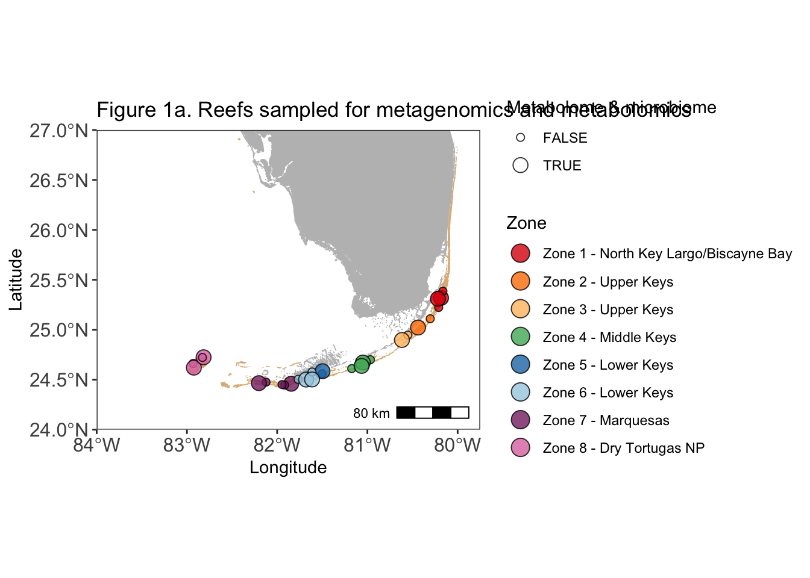
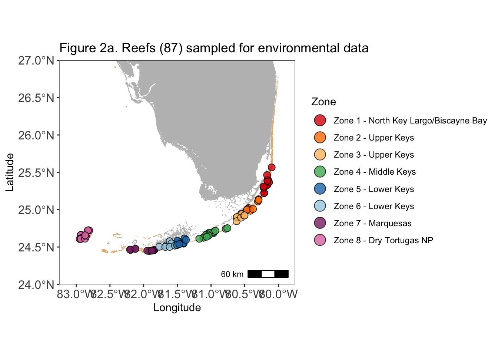
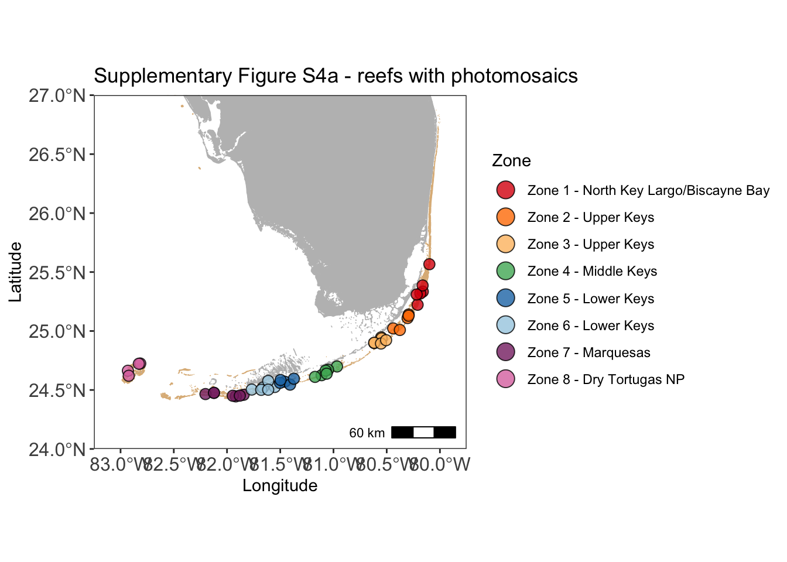

### Install necessary packages


```r
# For Maps
library(sf); packageVersion("sf")
library(ggspatial); packageVersion("ggspatial")

# For data wrangling
library(dplyr); packageVersion("dplyr")
library(tidyverse); packageVersion("tidyverse")
library(lubridate); packageVersion("lubridate")

# For microbiome/metagenome analysis

# For visualization
library(ggplot2); packageVersion("ggplot2")
theme_set(theme_bw()) # get rid of the gray background
```

### Read in prepped data

These tables are required for the subsequent analyses. Load **all** of them prior to generating figures. These tables are generated by the `Code_to_prep_data` document found at **THIS LINK NEEDS TO BE ADDED**. 

The shapefiles for making the map can be downloaded at the following links:
United States and Territories: https://earthworks.stanford.edu/catalog/stanford-vt021tk4894 
Florida Hard Bottom and Coral Habitats: https://geodata.myfwc.com/datasets/myfwc::coral-and-hard-bottom-habitats-in-florida/about


```r
# read in general metadata
metadata <- read.table("data/FLK2019_environmental_data_for_R.txt", sep = "\t", header = TRUE)

# path to the shapefiles. Download the shapefiles linked above and change the path to use this code
usa <- st_read("~/Documents/Apprill_lab/USVI_Projects/TideExpt/USVItideGitHub/Shapefile_for_Map/", "vt021tk4894") 
```

```
## Reading layer `vt021tk4894' from data source 
##   `/Users/cynthiabecker/Documents/Apprill_lab/USVI_Projects/TideExpt/USVItideGitHub/Shapefile_for_Map' 
##   using driver `ESRI Shapefile'
## Simple feature collection with 56 features and 4 fields
## Geometry type: MULTIPOLYGON
## Dimension:     XY
## Bounding box:  xmin: -179.1686 ymin: -14.59976 xmax: 179.7487 ymax: 71.38961
## Geodetic CRS:  WGS 84
```

```r
fcr <- st_read("~/Google Drive (cbecker@whoi.edu) (not syncing)/Alucia 2019/Site Maps/Coral_and_Hard_Bottom_Habitats_in_Florida/")
```

```
## Reading layer `Coral_and_Hard_Bottom_Habitats_in_Florida' from data source 
##   `/Users/cynthiabecker/Google Drive (cbecker@whoi.edu) (not syncing)/Alucia 2019/Site Maps/Coral_and_Hard_Bottom_Habitats_in_Florida' 
##   using driver `ESRI Shapefile'
## Simple feature collection with 15138 features and 6 fields
## Geometry type: POLYGON
## Dimension:     XY
## Bounding box:  xmin: -96.7856 ymin: 24.32566 xmax: -79.98332 ymax: 30.63009
## Geodetic CRS:  WGS 84
```


# Maps of Florida's Coral Reef
Code to generate maps included in **Figure 1a** and **Figure 2a**. 


```r
meta27 <- filter(metadata, Microbiomes == "TRUE") #subset only the sites with microbiome samples
metabenthic <- filter(metadata, BenthicSurvey == "TRUE") #subset only the sites with benthic data

#filter out only the coral reef part of the shapefile
coral <- fcr %>% filter(DESCRIPT == "Coral Reef")

rainbowpal <- c("#DC050C", "#FF7F00", "#FDBF6F", "#4EB265", "#1F78B4", "#A6CEE3", "#882E72", "#DE77AE")

# Figure 1a
ggplot() +
  geom_sf(data = coral, fill = "burlywood", color = "burlywood") +
  geom_sf(data = usa, fill = "gray", color = "gray") +
  geom_point(data = meta27, mapping = aes(x = long, y = lat, fill = FL_region_zone, size = Metagenomes), pch = 21, alpha = 0.8) +
  coord_sf(xlim = c(-84, -79.75), ylim = c(24, 27), expand = FALSE) +
  annotation_scale(location = "br", width_hint = 0.2) +
  theme(panel.grid.major = element_blank(), panel.background = element_rect(fill = "white")) +
  labs(x = "Longitude", y = "Latitude", fill = "Zone", size = "Metabolome & microbiome") +
  theme(axis.text = element_text(size = 12)) +
  scale_fill_manual(values = rainbowpal) +
  scale_size_manual(values = c(2, 4)) +
  guides(fill = guide_legend(override.aes = list(size = 5)))
```



```r
# Figure 2a
ggplot() +
  geom_sf(data = coral, fill = "burlywood", color = "burlywood") +
  geom_sf(data = usa, fill = "gray", color = "gray") +
  geom_point(data = metadata, mapping = aes(x = long, y = lat, fill = FL_region_zone), pch = 21, alpha = 0.8, size = 3) +
  coord_sf(xlim = c(-83.25, -79.75), ylim = c(24, 27), expand = FALSE) +
  annotation_scale(location = "br", width_hint = 0.2) +
  theme(panel.grid.major = element_blank(), panel.background = element_rect(fill = "white")) +
  labs(x = "Longitude", y = "Latitude", fill = "Zone") +
  theme(axis.text = element_text(size = 12)) +
  scale_fill_manual(values = rainbowpal) +
  guides(fill = guide_legend(override.aes = list(size = 5)))
```



```r
# Supplementary Figure S4a
ggplot() +
  geom_sf(data = coral, fill = "burlywood", color = "burlywood") +
  geom_sf(data = usa, fill = "gray", color = "gray") +
  geom_point(data = metabenthic, mapping = aes(x = long, y = lat, fill = FL_region_zone), pch = 21, alpha = 0.8, size = 3) +
  coord_sf(xlim = c(-83.25, -79.75), ylim = c(24, 27), expand = FALSE) +
  annotation_scale(location = "br", width_hint = 0.2) +
  theme(panel.grid.major = element_blank(), panel.background = element_rect(fill = "white")) +
  labs(x = "Longitude", y = "Latitude", fill = "Zone") +
  theme(axis.text = element_text(size = 12)) +
  scale_fill_manual(values = rainbowpal) +
  guides(fill = guide_legend(override.aes = list(size = 5)))
```



# Figure 1 and Table 1

### Distance-based redundancy analysis (dbRDA) reveals seawater microbiomes and metabolomes are explained by Florida’s Coral Reef biogeography and measured reef microbial and environmental parameters

a) Map of 27 coral reefs (out of 85 reefs visited in total) sampled across 8 color-coded zones for either both seawater metabolomes and microbiomes (13 reefs) or only seawater microbiomes (27 reefs total) during June 2019. The dbRDA include (b) reef water taxonomic microbiome via 16S rRNA gene sequencing of Bacteria and Archaea, (c) functional microbiome via shotgun metagenomics, (d) targeted metabolomes, (e) untargeted metabolomes that ionized in negative mode, and (f) untargeted metabolomes that ionized in positive mode. Syn. = Synechococcus, Pro. = Prochlorococcus, Picoeuk. = picoeukaryotes, SCTLD = stony coral tissue loss disease, TOC = total organic carbon, Het. microbes = heterotrophic microbes.

